# TBM 项目全貌说明书

> 面向导师、审稿人、后续接手者的项目逻辑说明。  
> 这份文档不按代码文件逐个解释，而是按“这个项目为什么这样设计、每一层在解决什么问题、关键指标怎么算、LLM 到底怎么被约束、实验到底证明了什么”来讲。

---

## 0. 先用一句话说明这个项目

这个项目不是简单地“让大语言模型写 TBM 施工日报”，而是先把 TBM 施工中的 PLC 运行数据、地质证据、气体监测、里程范围和报告边界治理成可追踪的工程证据，再让模板或大语言模型在这些证据约束下生成、检查和修订日报。

更准确地说，它研究的是：

```text
多源工程证据治理
-> 施工状态单元建模
-> 日施工状态孪生
-> 证据包约束生成
-> 报告主张级质量审计
-> 可追溯施工知识输出
```

施工日报只是这个系统目前最具体、最容易验证的输出形式。

---

## 1. 为什么不能直接让 LLM 写日报

TBM 施工日报不是普通文章。它里面的每一句话都可能对应施工范围、设备参数、地质证据或前方提示。

直接让大模型写，容易出现这些问题：

| 问题 | 具体表现 | 为什么危险 |
|---|---|---|
| 数值乱写 | 把 10 m 对齐复核范围写成实际推进范围 | 日报进尺错误 |
| 范围混淆 | 把 `1014600-1014620` 写成实际掘进 20 m | 实际 PLC 可能只有 15 m |
| 前方事实化 | 把前方预报写成已经揭露的地质事实 | 施工语义越界 |
| 地质结论过强 | 根据提示写成“发生塌方风险” | 没有灾害标签支撑 |
| 指标误解 | 把 GRCI 写成灾害概率 | 指标语义错误 |
| 停机误解 | 把 stop_ratio 高写成异常停机原因 | PLC 不区分计划停机和非计划停机 |
| 证据不可追踪 | 报告句子看起来合理，但找不到证据来源 | 不能复核 |

所以项目的基本思想是：

```text
不要让 LLM 直接面对原始数据。
先把原始数据治理成有边界的证据。
再让 LLM 在证据范围内组织文本。
最后对生成文本逐句审计。
```

---

## 2. 项目总体框架

可以把系统理解成七层。

**图 1 项目总体七层架构**

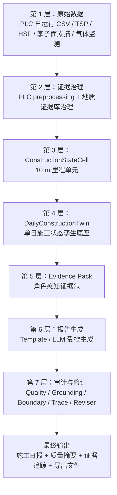

```text
第 7 层  报告审计与修订
        Quality / Grounding / Boundary / Structured Trace / Reviser
                    ↑
第 6 层  报告生成
        Template 或 LLM 在 Evidence Pack 约束下生成日报
                    ↑
第 5 层  Evidence Pack
        只挑选允许写入报告的结构化证据
                    ↑
第 4 层  DailyConstructionTwin
        把某一天的施工状态组织成可查询的孪生对象
                    ↑
第 3 层  ConstructionStateCell
        10 m 里程单元，融合 PLC、地质、气体、指标和 trace
                    ↑
第 2 层  证据治理
        PLC preprocessing + 地质证据库治理 + 时间/空间筛选
                    ↑
第 1 层  原始数据
        PLC 日运行 CSV、TSP/HSP/掌子面素描、气体监测、正式 evidence_db
```

这七层里面，真正的核心不是 LLM，而是第 2 到第 5 层的证据治理和状态建模。

**图 2 数据在系统中的主流向**

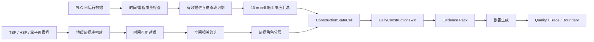

---

## 3. 系统输入是什么

### 3.1 PLC 日运行数据

PLC 数据回答的问题是：

```text
这一天 TBM 实际怎么运行？
推进到哪里？
速度、推力、扭矩、转速、贯入度表现如何？
气体有没有异常读数？
```

一个 PLC 样本可以抽象为：

```text
p_i = (t_i, m_i, v_i, F_i, T_i, omega_i, q_i, s_i, g_i)
```

| 符号 | 中文含义 | 常见字段 |
|---|---|---|
| `t_i` | 时间 | 运行时间-time |
| `m_i` | 里程 | 导向盾首里程、导向盾中里程、导向盾尾里程 |
| `v_i` | 推进速度 | 推进速度 |
| `F_i` | 推力 | 推力 |
| `T_i` | 刀盘扭矩 | 刀盘扭矩 |
| `omega_i` | 刀盘实际转速 | 刀盘实际转速 |
| `q_i` | 贯入度 | 贯入度 |
| `s_i` | 掘进状态 | 掘进状态 |
| `g_i` | 气体监测变量 | CO2、H2S、SO2、NO2、NO、CH4 |

### 3.2 地质证据

地质证据回答的问题是：

```text
截至这一天，已有地质资料提示了什么？
这些资料对应哪个里程范围？
它是已掘复核、前方关注，还是局部背景？
```

来源包括：

- TSP 超前预报；
- HSP 水平声波剖面；
- 掌子面素描；
- 其他正式整理后的地质记录。

系统不让 LLM 直接读取原始 PDF，而是先建立正式地质证据库。

### 3.3 正式 evidence_db

地质资料进入主流程前，要先变成正式证据库：

```text
TSP / HSP / 掌子面素描 PDF
-> 规则解析
-> EvidenceRecord
-> 清洗、去重、字段规范化
-> evidence_db.csv
-> 日报主流程读取
```

每条 EvidenceRecord 可以理解为一条地质证据单元，通常包括：

| 字段 | 含义 |
|---|---|
| evidence_id | 证据编号 |
| source_type | 来源类型，例如 TSP / HSP / sketch |
| report_date / issue_date | 证据日期 |
| start_num / end_num | 证据覆盖里程 |
| face_num / next_forecast_num | 掌子面或前方预报里程 |
| confidence | 证据可信度 |
| raw_text | 原始摘要文本 |
| attrs_json | 结构化属性 |

旁路 LLM 地质文本结构化模块也可以把文本抽成 candidate evidence，但它是候选证据，不会自动进入正式主流程。

---

## 4. PLC 施工响应证据怎么构建

PLC 处理是项目里很重要的一层。它不是算日均值，而是从混杂样本中提取“有效施工状态下的响应证据”。

### 4.0 PLC 处理的理论目标

PLC 原始样本可以写成一个时间序列：

```text
P_d = {p_i | i = 1, 2, ..., N_d}
```

其中第 `i` 个样本为：

```text
p_i = (t_i, m_i, v_i, F_i, T_i, omega_i, q_i, s_i, g_i)
```

项目真正要做的不是求：

```text
mean(P_d)
```

而是构造一个映射：

```text
Phi_plc: P_d -> R_cell
```

也就是把一整天混杂的 PLC 样本，变成每个 10 m 里程单元上的施工响应证据 `R_cell`。

这个映射有三层含义：

| 层次 | 含义 |
|---|---|
| 样本级 | 判断单个样本是否可信、是否停机、是否异常、是否有效掘进 |
| 区间级 | 判断一段连续样本是否构成连续有效掘进区间和稳态段 |
| cell 级 | 在 10 m 单元内统计速度、推力、扭矩、转速、贯入度和 proxy |

换句话说，PLC 证据构建的理论目标是：

```text
从“全部采样点”中提取“有效施工状态下的可解释响应”。
```

**图 3 PLC 施工响应证据构建流程**

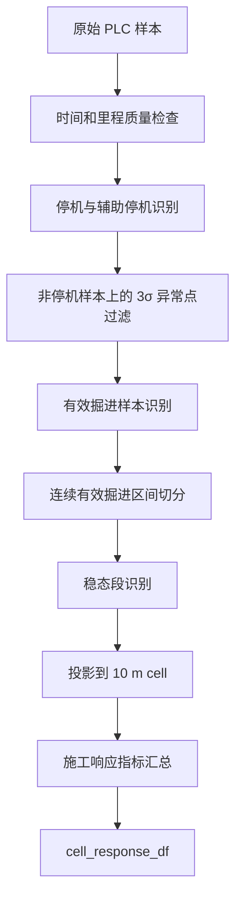

完整流程如下：

```text
原始 PLC 样本
-> 时间和里程质量检查
-> 停机与辅助停机识别
-> 3σ 异常点过滤
-> 有效掘进样本识别
-> 连续有效掘进区间切分
-> 稳态段识别
-> 10 m cell 指标汇总
```

### 4.1 时间和里程质量检查

第一步是确认样本能不能按时间和里程排起来。

相邻样本的时间间隔和里程增量为：

```text
Delta t_i = t_i - t_{i-1}
Delta m_i = m_i - m_{i-1}
```

时间断点阈值可以理解为：

```text
tau_t = max(3 * median(Delta t_i where Delta t_i > 0), 10)
```

如果：

```text
Delta t_i > tau_t
```

则认为这里存在时间断点。

里程反向和里程突跳可以简化理解为：

```text
chainage_reverse_i = 1 if Delta m_i < -0.01
chainage_jump_i    = 1 if abs(Delta m_i) > 5.0
```

检查内容包括：

| 检查 | 含义 | 目的 |
|---|---|---|
| 时间缺失 | 没有有效时间戳 | 不能判断样本顺序 |
| 时间倒序 | 后一个样本时间早于前一个样本 | 可能是数据乱序 |
| 时间断点 | 相邻样本时间间隔异常大 | 可能发生长时间停机或采样中断 |
| 里程缺失 | 无法映射到施工里程 | 不能进入 cell |
| 里程反向 | 里程突然倒退 | 可能是导向数据异常 |
| 里程突跳 | 相邻样本里程变化过大 | 可能是异常采样 |

它不是为了得出“地质异常”，只是为了保证后续统计建立在可排序、可投影的样本上。

### 4.2 停机与辅助停机识别

如果推力和扭矩没有主推进负载，这个样本不应被当作有效掘进响应。

当前主停机识别可以概括为：

```text
shutdown_i = (F_i <= 0) OR (T_i <= 0)
```

其中：

- `F_i` 是推力；
- `T_i` 是刀盘扭矩。

辅助非有效状态还会参考：

```text
advance_speed <= 0
cutterhead_rpm <= 0
```

因此，一个样本是否属于明显非主掘进状态，可以用下面的逻辑理解：

```text
non_excavation_i =
shutdown_i
OR (advance_speed_i <= 0)
OR (cutterhead_rpm_i <= 0)
```

注意：

```text
停机识别 ≠ 异常停机原因判断
```

当前 PLC 字段无法稳定区分计划停机和非计划停机。因此 stop_ratio 只能作为施工响应关注信号，不能写成“发生异常停机”的原因证据。

### 4.3 3σ 异常点过滤

在非停机样本上，对核心连续变量做异常采样识别：

```text
x_i < mean(x) - 3 * std(x)
或
x_i > mean(x) + 3 * std(x)
```

参与过滤的变量包括：

- 推进速度；
- 推力；
- 刀盘扭矩；
- 刀盘转速；
- 贯入度。

如果有效样本太少，系统会跳过对应字段的 3σ 过滤，避免小样本误判。

对多个变量综合时，可以理解为：

```text
outlier_i = OR(outlier_{i,x})
```

其中：

```text
x in {advance_speed, thrust, torque, rpm, penetration}
```

注意：

```text
3σ 异常点只是统计异常采样，不是地质异常。
```

### 4.4 有效掘进样本识别

有效掘进样本要同时满足：

```text
非停机
非异常点
里程有效
推力 > 0
扭矩 > 0
推进速度 > 0
刀盘转速 > 0
如存在工作状态标记，则工作状态也要有效
```

形式化可写为：

```text
valid_i =
NOT shutdown_i
AND NOT outlier_i
AND mileage_valid_i
AND thrust_i > 0
AND torque_i > 0
AND advance_speed_i > 0
AND rpm_i > 0
AND optional_working_state_i
```

通俗地说：

```text
只有 TBM 真的在向前掘进、刀盘在转、有主推负载、数据没有明显异常时，
这个样本才进入施工响应统计。
```

这样做的意义是避免停机样本把均值拉低。

### 4.5 连续有效掘进区间切分

单个有效样本不一定代表稳定施工。系统还会判断有效样本是否连续。

如果出现以下情况，就开启新的有效掘进区间：

- 前一个样本无效；
- 当前和前一个样本之间有明显时间断点；
- 里程发生反向；
- 数据状态中断。

形式化可以理解为：

```text
new_interval_i =
NOT valid_{i-1}
OR time_gap_i
OR chainage_reverse_i
OR state_break_i
```

过短区间通常被认为是过渡状态，不适合作为稳定施工响应证据。

### 4.6 稳态段识别

在连续有效掘进区间中，系统进一步找相对稳定的片段。

**图 4 有效掘进区间与稳态段识别逻辑**

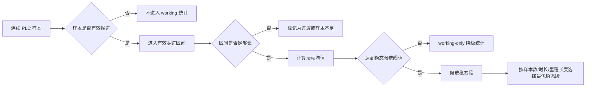

当前逻辑优先使用推进速度作为稳态检测信号。如果推进速度不可用，才降级使用贯入度信号。

简化理解：

```text
先看一段连续掘进中的速度滚动均值。
如果某段滚动均值达到整体典型水平的一定比例，就认为它可能是稳态候选段。
```

形式上可以理解为：

```text
rolling_mean(y, window=20) >= 0.8 * median(rolling_mean(y))
```

其中检测信号 `y` 的选择逻辑是：

```text
优先 y = advance_speed
如果推进速度不可用，再降级 y = penetration
```

稳态候选样本可以写成：

```text
steady_candidate_i = 1
if rolling_mean(y_i, window=20) >= 0.8 * median_rolling_y
else 0
```

候选稳态段不止一个时，优先选择：

1. 样本数最多；
2. 持续时间最长；
3. 里程覆盖最长；
4. 出现时间更早。

如果找不到稳态段，但有效工作样本足够，系统可以使用 working-only 降级统计，并记录 fallback。

### 4.7 10 m cell 施工响应汇总

最后把样本投影到 10 m 里程单元中。

每个 cell 会得到一组施工响应指标：

| 中文含义 | 英文字段 | 解释 |
|---|---|---|
| 有效工作样本数 | `working_sample_count` | cell 内有效掘进样本数量 |
| 有效工作比例 | `working_ratio` | 有效样本占 cell 总样本比例 |
| 稳态样本数 | `steady_state_sample_count` | 稳态段样本数量 |
| 稳态比例 | `steady_state_ratio` | 稳态样本占 cell 总样本比例 |
| 推进速度统计 | `speed_mean/std/cv` | 速度均值、标准差、变异系数 |
| 推力统计 | `thrust_mean/std/cv` | 主推负载统计 |
| 扭矩统计 | `torque_mean/std/cv` | 刀盘负载统计 |
| 转速统计 | `rpm_mean/std/cv` | 刀盘转速统计 |
| 贯入度统计 | `penetration_mean/std/cv` | 贯入效率相关统计 |
| 刀盘负载代理 | `cutterhead_power_proxy` | 扭矩与转速构造的 proxy |
| 单位贯入推力代理 | `thrust_per_penetration` | 推力 / 贯入度 |
| 单位贯入扭矩代理 | `torque_per_penetration` | 扭矩 / 贯入度 |

必须注意：

```text
cutterhead_power_proxy 不是严格物理功率。
thrust_per_penetration 不是严格比能。
torque_per_penetration 不是严格比能。
这些只是施工响应解释性指标。
```

### 4.8 cell 级统计公式

设第 `c` 个 10 m 单元为：

```text
C_c = [a_c, b_c), b_c - a_c = 10 m
```

该 cell 内全部样本集合为：

```text
P_c = {p_i | m_i in C_c}
```

有效掘进样本集合为：

```text
W_c = {p_i in P_c | valid_i = 1}
```

稳态样本集合为：

```text
S_c = {p_i in P_c | steady_i = 1}
```

于是有：

```text
working_ratio_c = |W_c| / |P_c|
steady_state_ratio_c = |S_c| / |P_c|
steady_to_working_ratio_c = |S_c| / |W_c|
```

对于任意核心参数：

```text
x in {advance_speed, thrust, torque, rpm, penetration}
```

稳态均值、标准差和变异系数为：

```text
mean_{c,x} = mean(x_i where p_i in S_c)
std_{c,x}  = std(x_i where p_i in S_c)
cv_{c,x}   = std_{c,x} / abs(mean_{c,x})
```

如果稳态样本不足，则使用 working-only 降级统计，并记录 fallback。这样做的意义是：宁愿明确标记“证据质量下降”，也不把全样本均值伪装成稳态施工响应。

三个 proxy 指标可以理解为：

```text
cutterhead_power_proxy_c = mean_torque_c * mean_rpm_c
thrust_per_penetration_c = mean_thrust_c / mean_penetration_c
torque_per_penetration_c = mean_torque_c / mean_penetration_c
```

这些 proxy 只表达“负载与贯入效率之间的相对关系”，不表达严格物理功率或严格比能。

---

## 5. 地质证据怎么进入日报

地质证据处理回答的问题不是“预测会不会出灾害”，而是：

**图 5 地质证据库建立与日报级筛选**

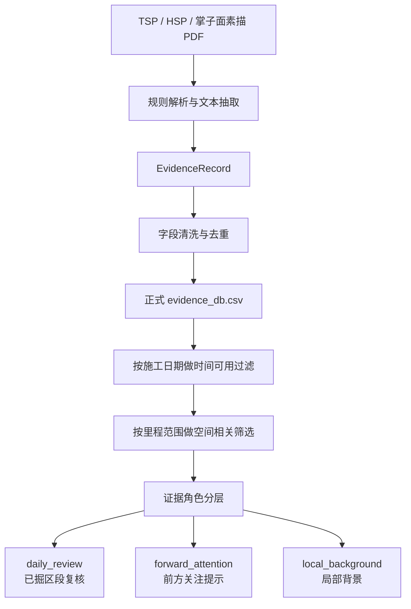

```text
在当前日报日期，哪些地质证据已经可用？
这些证据空间上对应哪里？
它们能作为已掘复核、前方关注，还是局部背景？
```

### 5.1 时间可用过滤

对施工日期 `d`，只允许使用日期不晚于 `d` 的证据：

```text
evidence_date <= report_date
```

这一步避免未来信息泄漏。

### 5.2 空间相关筛选

系统会计算证据范围和日报范围、当前掌子面、前方范围、局部背景范围之间的关系。

主要范围包括：

| 范围 | 含义 |
|---|---|
| `daily_plc_range` | PLC 实测当日推进范围 |
| `daily_excavated_scope` | 10 m cell 对齐后的已掘复核范围 |
| `current_face` | 当前掌子面附近 |
| `forward_attention` | 掌子面前方 0-30 m |
| `local_background` | 当日附近的背景证据范围 |

### 5.3 三类证据角色

| 角色 | 中文含义 | 可以怎么写 | 禁止怎么写 |
|---|---|---|---|
| `daily_review` | 已掘区段复核证据 | 用于复核当天已掘区段的地质-施工响应 | 不得写成前方预测 |
| `forward_attention` | 当前掌子面前方关注证据 | 写成“前方关注提示” | 不得写成已发生事实，不得使用 GRCI |
| `local_background` | 局部背景证据 | 提供上下文 | 不得作为当日结论 |

这是项目很关键的边界控制。

---

## 6. ConstructionStateCell 是什么

`ConstructionStateCell` 可以理解为：

**图 6 ConstructionStateCell 内部信息组成**

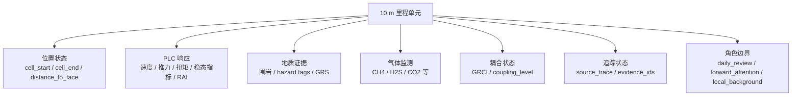

```text
一个 10 m 里程单元内的施工状态卡片。
```

它把同一空间范围内的多源信息放到一起：

```text
位置状态
+ PLC 施工响应
+ 地质证据
+ 气体监测
+ RAI / GRS / GRCI
+ source_trace
+ role boundary
```

它解决的是“多源数据空间粒度不统一”的问题。

例如：

```text
PLC 是高频时间序列。
地质证据是一个里程区间。
日报需要写当日区段。
LLM 需要结构化证据。
```

ConstructionStateCell 把它们统一到 10 m cell。

---

## 7. DailyConstructionTwin 是什么

`DailyConstructionTwin` 不是物理仿真数字孪生。它不是模拟 TBM 力学，也不是预测地质灾害。

**图 7 DailyConstructionTwin 的组织方式**

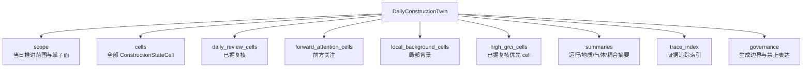

它更像是：

```text
某一天日报所需的施工状态证据底座。
```

它包含：

| 部分 | 含义 |
|---|---|
| `scope` | 当日 PLC 推进范围、对齐复核范围、掌子面位置 |
| `cells` | 全部 ConstructionStateCell |
| `daily_review_cells` | 已掘复核 cell |
| `forward_attention_cells` | 前方关注 cell |
| `local_background_cells` | 局部背景 cell |
| `high_grci_cells` | 已掘复核中 GRCI 较高的 cell |
| `summaries` | 当日运行、地质、气体、耦合摘要 |
| `trace_index` | 证据追踪索引 |
| `governance` | 方法边界和角色约束 |

DailyConstructionTwin 的作用是把“当天日报该看什么”一次组织好。

---

## 8. RAI / GRS / GRCI 怎么理解

这三个指标都不是概率模型，也不是监督学习预测模型。

**图 8 RAI / GRS / GRCI 的关系**

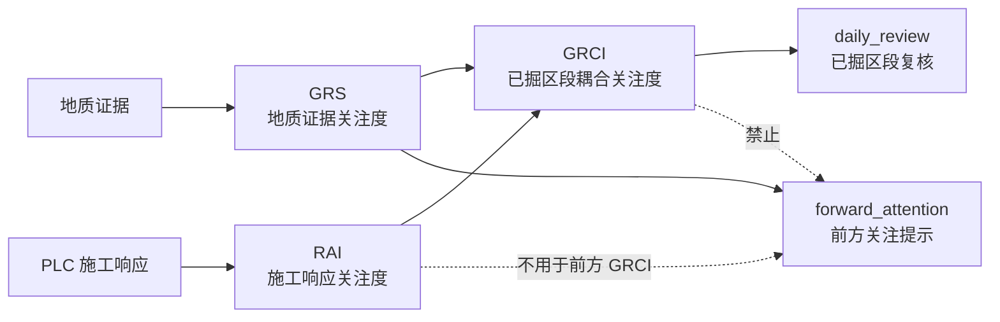

它们的定位是：

```text
启发式关注指标
```

### 8.1 RAI：施工响应关注度

RAI 用来描述 cell 内施工响应是否值得关注。

当前公式：

```text
RAI =
0.40 * stop_ratio
+ 0.25 * abnormal_ratio
+ 0.20 * speed_drop_score
+ 0.10 * torque_volatility_score
+ 0.05 * speed_volatility_score
```

| 分量 | 中文含义 |
|---|---|
| `stop_ratio` | 停机或非工作比例 |
| `abnormal_ratio` | 异常样本比例 |
| `speed_drop_score` | 推进速度下降关注分 |
| `torque_volatility_score` | 扭矩波动关注分 |
| `speed_volatility_score` | 速度波动关注分 |

注意：

```text
RAI 不是设备故障概率。
stop_ratio 高不能直接写成异常停机原因。
```

RAI 的设计逻辑是把施工响应异常分成五类：

| 分量 | 关注的问题 | 为什么给这个权重 |
|---|---|---|
| stop_ratio | cell 内非工作/停机占比 | 停机会显著影响施工连续性，因此权重最高 |
| abnormal_ratio | 异常采样比例 | 反映参数不稳定或采样异常 |
| speed_drop_score | 推进速度下降 | 推进效率变化是施工响应的重要表现 |
| torque_volatility_score | 扭矩波动 | 反映刀盘负载波动 |
| speed_volatility_score | 速度波动 | 反映推进过程平稳性 |

权重不是监督学习标定结果，而是工程启发式。当前项目已经通过 Exp03 做了指标稳健性旁路分析，但没有把 RAI 解释为预测模型。

### 8.2 GRS：地质证据关注度

GRS 用来描述 cell 内地质证据关注程度。

当前公式：

```text
GRS =
0.45 * grade_score_component
+ 0.45 * hazard_component
+ 0.10 * confidence_component
```

| 分量 | 中文含义 |
|---|---|
| `grade_score_component` | 围岩等级或地质等级分量 |
| `hazard_component` | 破碎、裂隙、掉块、异常反射等关注标签分量 |
| `confidence_component` | 证据可信度分量 |

注意：

```text
GRS 不是灾害概率。
GRS = 0 也不一定表示低关注，需要看 GRS_available。
```

GRS 的设计逻辑是把地质关注度拆成三部分：

| 分量 | 含义 |
|---|---|
| grade_score_component | 围岩等级或地质等级越差，关注度越高 |
| hazard_component | 破碎、裂隙、掉块、异常反射、出水等标签越强，关注度越高 |
| confidence_component | 证据来源越可靠、trace 越完整，越适合作为报告依据 |

因此 GRS 不是“某地会发生灾害的概率”，而是“已有地质证据对该 cell 的关注强度”。

### 8.3 GRCI：地质-施工响应耦合关注度

GRCI 用来描述已掘复核 cell 中，地质证据和施工响应是否共同值得关注。

当前公式：

```text
GRCI =
0.55 * GRS_geo_base
+ 0.35 * RAI
+ 0.10 * GRS_geo_base * RAI
```

其中交互项：

```text
GRS_geo_base * RAI
```

表示地质关注和施工响应关注同时较高时，耦合关注度增加。

注意：

```text
GRCI 只用于 daily_review 已掘复核 cell。
GRCI 不用于 forward_attention。
GRCI 不是灾害概率。
GRCI 不是前方风险。
```

GRCI 的设计逻辑是：

```text
地质证据高 + 施工响应高 -> 更值得已掘复核
地质证据高 + 施工响应低 -> 有地质关注，但施工响应未明显共振
地质证据低 + 施工响应高 -> 有施工响应关注，但不能强行归因地质
两者都低 -> 不作为高关注复核 cell
```

所以 GRCI 适合写成：

```text
该已掘区段存在地质证据与施工响应共同关注，建议复核。
```

不适合写成：

```text
该区段发生灾害概率为 GRCI。
```

### 8.4 可用性逻辑

指标是否可用和指标值大小同样重要。

| 指标 | 可用条件 | 不可用时不能怎么解释 |
|---|---|---|
| RAI | cell 有 PLC response | 不能把缺 PLC 写成低响应 |
| GRS | cell 有空间相关地质证据且成功融合 | 不能把无证据写成低地质关注 |
| GRCI | daily_review cell 且 RAI、GRS 都可用 | 不能给 forward_attention 计算 GRCI |

特别是：

```text
GRS_available = false
```

表示“没有可用空间相关地质证据”或“证据几何不可用”，不是“地质低风险”。

---

## 9. Evidence Pack 是什么

Evidence Pack 是 LLM 或模板生成报告前的证据包。

**图 9 Evidence Pack 如何约束报告生成**

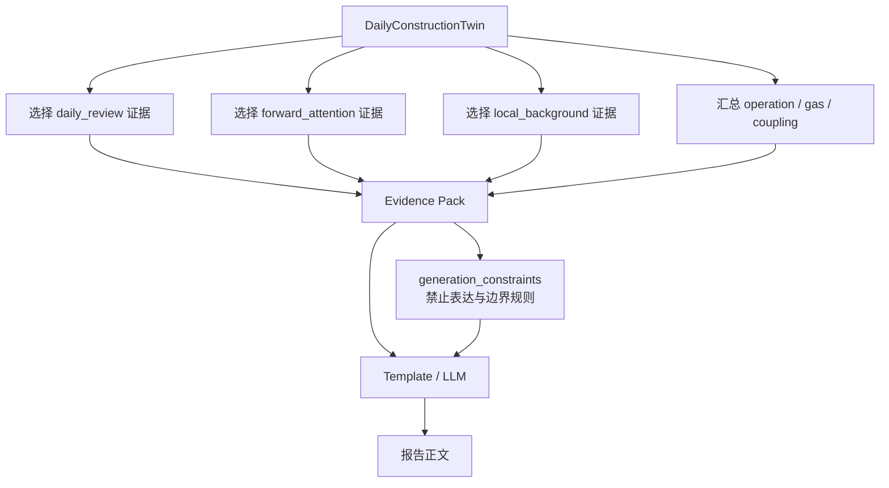

它不是全部原始数据，而是经过筛选和角色约束后的材料。

主要包含：

| 部分 | 含义 |
|---|---|
| `operation_evidence` | PLC 施工运行证据 |
| `gas_evidence` | 气体监测证据 |
| `geology_evidence` | 已掘复核和局部地质证据 |
| `coupling_evidence` | RAI / GRS / GRCI 相关证据 |
| `forward_evidence` | 前方关注提示证据 |
| `source_trace` | 证据来源追踪 |
| `generation_constraints` | 禁止表达和边界规则 |

Evidence Pack 的核心作用是：

```text
限制 LLM 可以写什么。
限制 LLM 不能怎么写。
```

### 9.1 Evidence Pack 的选择分数

不同角色的 cell 会有不同 selection score。

**图 10 三类证据角色的选择逻辑**

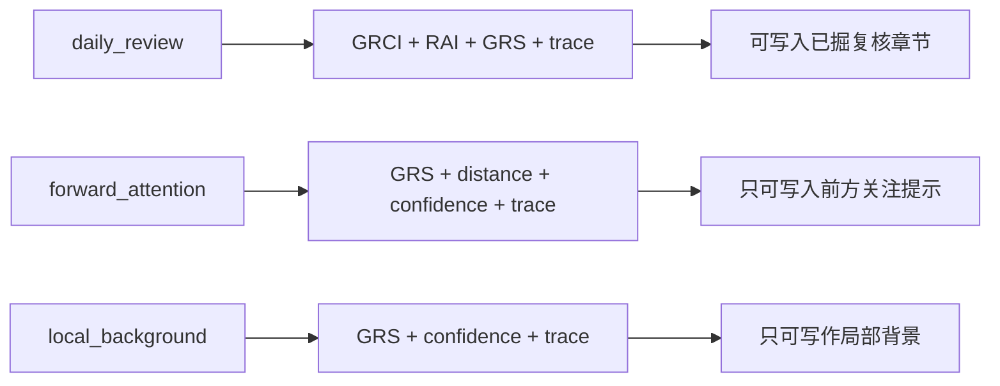

daily_review 的选择逻辑倾向于：

```text
0.40 * GRCI
+ 0.25 * RAI
+ 0.25 * GRS
+ 0.10 * trace_completeness
```

forward_attention 的选择逻辑倾向于：

```text
0.45 * GRS
+ 0.25 * forward_distance_weight
+ 0.20 * evidence_confidence
+ 0.10 * trace_completeness
```

local_background 的选择逻辑倾向于：

```text
0.50 * GRS
+ 0.25 * evidence_confidence
+ 0.25 * trace_completeness
```

这体现了一个重要边界：

```text
forward_attention 不使用 GRCI。
```

### 9.2 选择分数的理论含义

Evidence Pack 的 selection score 不是风险分数，而是“报告选材优先级”。

它解决的问题是：

```text
一个日报里不可能把所有 cell 和所有证据都写进去。
系统必须选择最值得进入报告的证据。
```

所以不同角色有不同权重：

| 角色 | 主要依据 | 为什么 |
|---|---|---|
| daily_review | GRCI、RAI、GRS、trace | 已掘复核需要同时看施工响应和地质证据 |
| forward_attention | GRS、距离掌子面远近、证据可信度、trace | 前方只能用地质证据和距离，不得用施工响应耦合 |
| local_background | GRS、证据可信度、trace | 背景只提供上下文，不做当日结论 |

这体现了项目的核心逻辑：

```text
同一个地质证据，在不同角色下有不同写法。
```

比如：

```text
daily_review:
    可写“已掘区段内存在地质证据与施工响应共同关注”。

forward_attention:
    只能写“当前掌子面前方存在需要关注的地质提示”。

local_background:
    只能写“邻近区段存在类似地质背景”。
```

---

## 10. 报告生成有哪几条链路

当前可以分成两类。

### 10.1 后端通用日报生成链路

这是 API 和 backend pipeline 的通用链路。

```text
DailyConstructionTwin / Evidence Pack
-> template 或 LLM
-> 质量检查
-> trace
-> 返回 report / debug
```

它服务于后端接口和日常导出。

### 10.2 Exp02 实验链路

Exp02 是论文实验用的生成模式对比链路。

它有五个模式：

| 模式 | 含义 | 目的 |
|---|---|---|
| M0 | 模板生成 | 稳定格式基线 |
| M1 | 直接 LLM 生成 | 检查自由生成风险 |
| M2 | 原始证据输入 LLM | 检查“只给材料”是否足够 |
| M3 | ConstructionStateCell + Evidence Pack | 检查结构化证据包作用 |
| M4 | Twin + Evidence Pack + Boundary + Structured Trace + Reviser | 验证完整治理闭环 |

当前最新、最复杂、最能代表论文主方法的是：

```text
M4 structured_trace_v1
```

### 10.3 M4 到底做什么

M4 可以理解为闭环：

**图 11 M4 受控生成与反馈修订闭环**

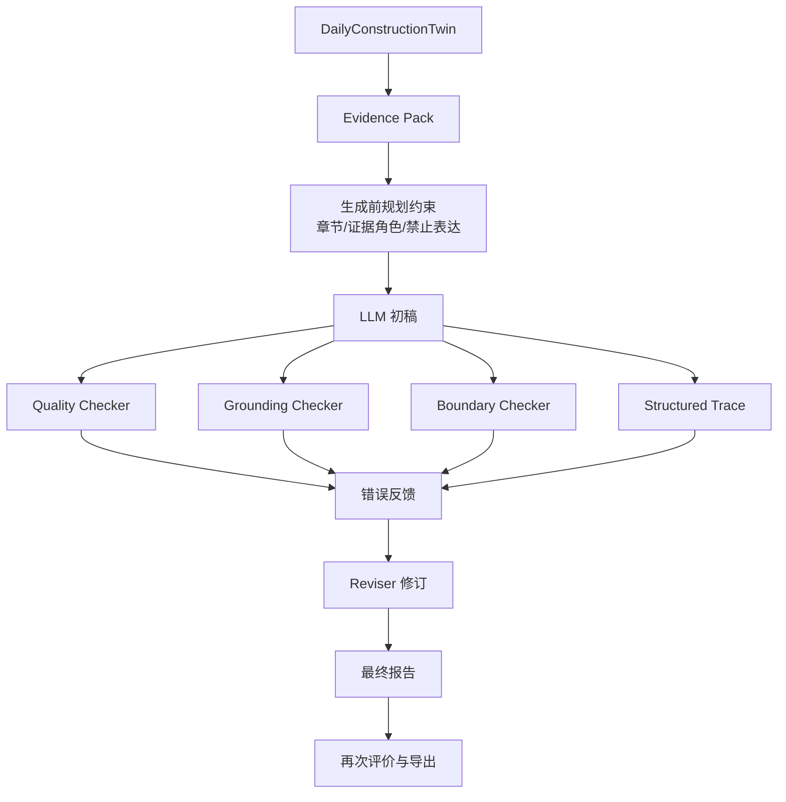

```text
1. 构建 Twin 和 Evidence Pack
2. 用 prompt-level planning constraints 约束章节和证据角色
3. LLM 生成初稿
4. Quality / Grounding / Boundary / Structured Trace 审计初稿
5. 把错误类型、原句、证据缺口和修改建议反馈给 LLM
6. LLM 生成修订稿
7. 再次评价最终稿
```

这里的修订不是润色，而是：

```text
删除无证据句子
降级过强结论
改写数值不严谨表达
补齐或保留标准章节
避免前方事实误用
避免 GRCI 概率化
```

---

## 11. Quality / Grounding / Boundary / Trace 怎么评价报告

评价系统不是人工评分，而是自动审计。

**图 12 报告自动评价体系**

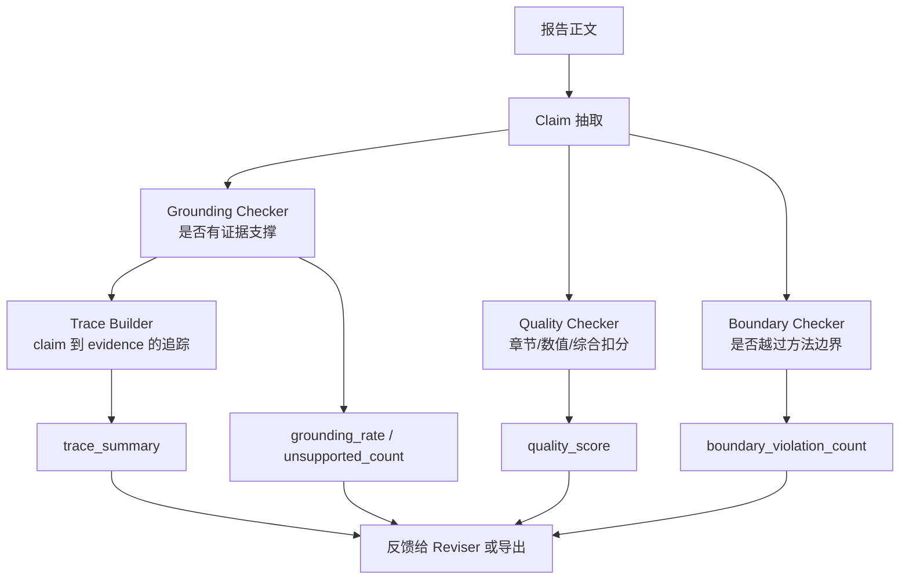

### 11.1 Claim 抽取

系统先从报告里抽取主张。

主张可以是：

- 数值主张；
- 地质主张；
- 施工响应主张；
- 前方关注主张；
- 建议类主张；
- 指标解释类主张。

### 11.2 Grounding Checker

Grounding Checker 判断：

```text
这句话能不能在 Evidence Pack 中找到支撑？
```

输出包括：

| 字段 | 含义 |
|---|---|
| `grounded_claim_count` | 有证据支撑的主张数 |
| `unsupported_claim_count` | 无证据支撑的主张数 |
| `grounding_rate` | 有证据支撑比例 |
| `trace_support_type` | 支撑类型 |
| `mismatch_type` | 不匹配类型 |

grounding rate 的基本公式是：

```text
grounding_rate = grounded_claim_count / claim_count
```

unsupported claim count 为：

```text
unsupported_claim_count = claim_count - grounded_claim_count
```

一个 claim 是否 grounded，不是看它“听起来合理”，而是看它是否能在 Evidence Pack / source trace / allowed policy 中找到对应支撑。

### 11.3 Quality Checker

Quality Checker 综合检查：

- 标准章节是否完整；
- 是否有 unsupported claim；
- 是否有 numeric error；
- 是否有 E14；
- 是否有边界违规；
- 是否有 GRCI 概率化；
- 是否把 forward 写成事实；
- 是否把 proxy 写成真实物理量。

quality score 是自动质量分，不是人工评分。

质量分可以理解为：

```text
quality_score = 100 - penalties
```

扣分来源包括：

| 扣分来源 | 含义 |
|---|---|
| unsupported claim | 报告主张缺少证据支撑 |
| numeric error | 数值无法从证据包匹配，或数值语义错误 |
| E14 | 把对齐复核范围写成实际推进范围或实际日进尺 |
| boundary violation | 前方事实误用、GRCI 概率化、proxy 误写等 |
| missing sections | 缺少标准日报章节 |

这个分数用于比较不同生成模式，不应写成“专家评分”。

### 11.4 Boundary Checker

Boundary Checker 专门看边界错误。

主要检查：

| 类型 | 错误含义 |
|---|---|
| GRCI 概率化 | 把 GRCI 写成灾害概率或风险概率 |
| 前方事实误用 | 把 forward_attention 写成已揭露事实 |
| PLC proxy 误写 | 把 proxy 写成真实功率或严格比能 |
| stop_ratio 因果误用 | 把停机比例直接写成异常原因 |
| local_background 越界 | 把背景证据写成当日结论 |

### 11.5 E14 是什么

E14 专门检查一个典型错误：

```text
把 10 m cell 对齐后的复核范围写成实际推进范围或实际日进尺。
```

例如：

```text
daily_excavated_scope = 1014600-1014620
```

这只是对齐范围，不代表实际推进 20 m。

实际推进要看：

```text
daily_plc_range
daily_advance_m
```

### 11.6 Revision reduction rate

M4 的修订效果用修订前后 unsupported claim 数量衡量。

```text
reduction_count =
pre_revision_unsupported_total - post_revision_unsupported_total
```

```text
reduction_rate =
reduction_count / pre_revision_unsupported_total
```

它回答的问题是：

```text
自动修订是不是只是润色？
还是确实减少了无证据主张？
```

---

## 12. API 输出是什么

当前后端对外 API 很少，刻意保持简单。

| API | 作用 |
|---|---|
| `GET /api/tbm/health` | 检查后端是否正常 |
| `GET /api/tbm/dates` | 获取可用日期 |
| `POST /api/tbm/report` | 生成普通报告结果 |
| `POST /api/tbm/report/debug` | 生成包含中间结果的调试输出 |

普通报告适合前端展示。

debug 输出适合研究、论文复盘和检查中间对象。

---

## 13. 实验体系说明

### 13.1 Exp01：主流程可用性

**图 13 当前实验体系**

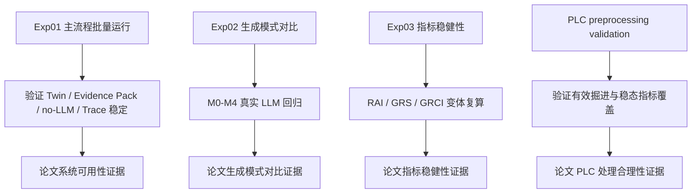

Exp01 检查：

```text
真实数据能否从 PLC 和地质证据一路跑到 Twin、Evidence Pack、Report、Quality、Trace。
```

它证明系统能稳定运行。

### 13.2 Exp02：生成模式对比

Exp02 是论文最核心实验。

它回答：

```text
为什么不能直接让 LLM 写？
为什么 Evidence Pack + Boundary + Trace + Reviser 更好？
```

当前 structured_trace_v1 91 天真实 LLM 回归：

```text
91 dates × 5 modes = 455 runs
failed_count = 0
```

M4 相比 M1/M2/M3 显著减少：

- unsupported claim；
- numeric error；
- boundary violation；
- missing sections。

### 13.3 Exp03：指标稳健性

Exp03 不改主流程，只旁路复算 RAI / GRS / GRCI 变体。

它回答：

```text
当前启发式指标是不是完全依赖某一套权重？
```

如果不同变体的排序相关较高，说明当前指标有一定稳健性。

如果 Top-K 差异明显，说明高关注 cell 选择仍受耦合形式影响。

---

## 14. 当前项目能证明什么

当前代码和实验可以支撑：

1. 多源证据可以被组织成日报生成所需的结构化证据。
2. PLC 不是简单日均统计，而是经过有效掘进和稳态筛选后的施工响应证据。
3. ConstructionStateCell 能把 PLC、地质、气体和 trace 对齐到 10 m 里程单元。
4. DailyConstructionTwin 能作为单日施工状态证据底座。
5. Evidence Pack 能约束 LLM 生成边界。
6. M4 完整治理闭环比直接 LLM、原始证据 LLM、仅 Evidence Pack LLM 更稳定。
7. Structured Trace 和 Reviser 能减少 unsupported claim。
8. E14、forward fact misuse、GRCI probability misuse 等关键边界错误可以被自动检查。

---

## 15. 当前项目不能证明什么

当前项目不能证明：

1. GRCI 是灾害概率。
2. RAI 能诊断设备故障原因。
3. GRS 能预测地质灾害。
4. LLM 能判断地质风险。
5. 该方法已经跨工程泛化。
6. 自动评价完全等同人工工程评价。
7. PLC proxy 是严格物理功率或严格比能。
8. forward_attention 表示前方已经发生异常。

这些都必须写成研究边界。

---

## 16. 如果给老师讲，最简版本怎么讲

可以这样讲：

```text
这个项目不是直接用大模型写日报。
它先把 TBM 的 PLC 数据和地质资料整理成按 10 m 里程划分的施工状态单元。
每个单元里有施工响应、地质证据、气体监测、证据来源和几个关注指标。
然后把当天所有单元组织成 DailyConstructionTwin。
再从 Twin 里挑选能写进报告的证据，形成 Evidence Pack。
大模型只能根据 Evidence Pack 写，不能自己编数值、不能把前方预报写成事实、不能把 GRCI 写成概率。
写完以后，系统还会逐句检查报告有没有证据支撑、数值有没有来源、边界有没有越界。
如果有问题，再把问题反馈给大模型修订。
实验上，用 91 天真实 LLM 回归比较了 M0-M4 五种方法，完整治理链路 M4 的质量、证据支撑、数值错误和边界错误表现最好。
```

---

## 17. 最应该继续补强什么

现在不建议继续大改主代码。

最值得做的是：

| 优先级 | 事情 | 原因 |
|---|---|---|
| P0 | 把论文方法章节写清楚 | 当前最影响论文质量 |
| P0 | 评价体系公式化 | 审稿人一定会问 quality/grounding 怎么算 |
| P1 | 统计检验和效应量整理 | 支撑“明显优于” |
| P1 | 典型案例分析 | 让结果表变成可理解故事 |
| P1 | 人工复核表准备 | 补自动评价不足 |
| P2 | 参考文献补齐 | 把 PLC、地质、LLM 评价接到已有研究 |

不建议现在做：

- 新增深度学习预测模型；
- 重新设计 GRCI；
- 再改 prompt/checker 后重跑 91 天；
- 恢复 Agent；
- 做复杂前端大屏。

---

## 18. 阅读路线

如果只想理解项目：

```text
先读本文档
再读 README.md
再读 paper_materials/README.md 和 paper_materials/06_full_paper_draft/full_paper_draft_v2_autcon_style.md
```

如果要写论文：

```text
paper_materials/06_full_paper_draft/
paper_materials/01_exp02_results/
paper_materials/02_statistics/
paper_materials/03_case_studies/
paper_materials/04_indicator_robustness/
```

如果要看代码：

```text
backend/pipeline/daily_report_pipeline.py
backend/plc/paper_based_preprocessing.py
backend/plc/cell_response.py
backend/coupling/grs_rai_grci.py
backend/twin/construction_twin.py
backend/llm/evidence_pack.py
backend/llm/report_quality_checker.py
backend/llm/report_grounding_checker.py
backend/llm/twin_boundary_checker.py
```
