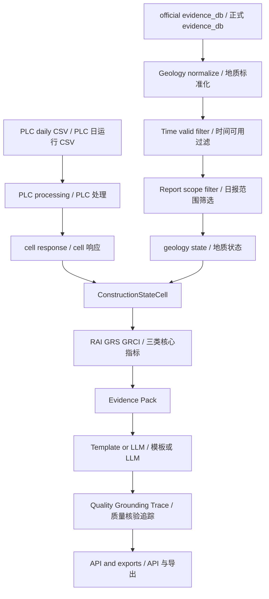
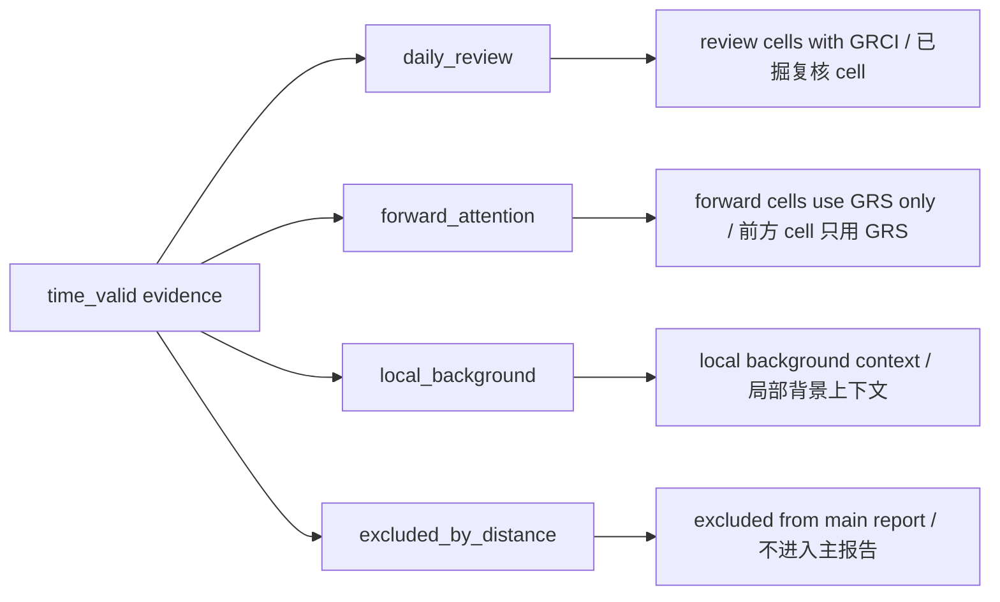
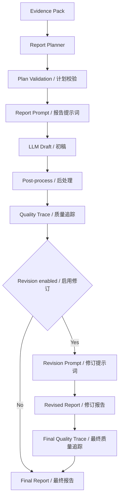

# TBM 日报后端文档索引

本目录只保留当前后端研究原型仍需要阅读和维护的文档。当前后端主线为：

```text
routes.report
-> run_daily_report_pipeline
-> ConstructionStateCell
-> Evidence Pack
-> Planner / Generator / Revision
-> Quality / Trace
-> Report / Export
```

`_archive/`、旧 Agent、旧 `routes/tbm.py`、旧 segment 级 GRCI、旧 history memory 不参与当前主流程。

## 推荐阅读路径

1. [系统架构与执行路线](system_architecture.md)  
   面向首次阅读者，说明当前后端真实如何从 PLC 与地质证据生成日报，并包含主流程结构图。

2. [字段契约](backend_field_contract.md)  
   说明 `DailyReportResult`、`ConstructionStateCell`、Evidence Pack、Quality / Trace、API 与导出字段。

3. [方法与计算逻辑白皮书](method_calculation_whitepaper.md)  
   面向方法复盘和论文写作，详细解释 RAI、GRS、GRCI、证据分层、字段来源和计算公式。

4. [LLM 生成模式](llm_generation_modes.md)  
   说明 `template`、`evidence_pack_llm`、`evidence_pack_llm_with_revision`、`evidence_pack_planner_llm`、`evidence_pack_planner_llm_with_revision` 的差异、约束和导出文件。

5. [批量审计与多日期运行](batch_pipeline.md)  
   说明 90 天数据审计、日期分类、批量 no-LLM pipeline、批量 LLM 生成脚本。

6. [旁路式地质文本结构化](geology_text_extraction.md)  
   说明 P3 sidecar 模块如何把地质文本抽取成候选证据，以及为什么不进入正式主链路。

7. [论文写作上下文包](paper_writing_context.md)  
   给论文写作或外部 LLM 使用的项目上下文，强调当前系统已经实现什么、没有实现什么。

8. [LLM 简版上下文](llm_context_brief.md)  
   更短的上下文包，适合快速贴给外部模型。

9. [实验规划](experiment_plan.md)  
   说明后续论文实验可以如何基于当前导出结果展开。

## 当前主流程结构图



## 证据分层结构图



## LLM 生成结构图



## 已合并或移除的旧文档

以下文档属于阶段性说明或旧索引，内容已经合并到上述当前文档中，因此不再保留在 `backend/docs` 根目录：

- `current_backend_system_manual.md`：合并到 [系统架构与执行路线](system_architecture.md) 与 [方法与计算逻辑白皮书](method_calculation_whitepaper.md)。
- `case_2023-12-30.md`：真实案例信息合并到 [方法与计算逻辑白皮书](method_calculation_whitepaper.md) 的复盘说明与导出字段解释中。
- `quality_trace_boundary_update.md`：合并到 [字段契约](backend_field_contract.md)、[LLM 生成模式](llm_generation_modes.md) 与白皮书的 Quality / Trace 部分。
- `method_definition.md`、`metrics_definition.md`、`scope_and_limitations.md`：合并到 [方法与计算逻辑白皮书](method_calculation_whitepaper.md) 与 [论文写作上下文包](paper_writing_context.md)。
- `archive_plan.md`：归档说明合并到根 README、后端 README 和本文档。

后续如果新增文档，请优先放入上述阅读路径；不要再新增只记录单次修复过程的临时说明。
