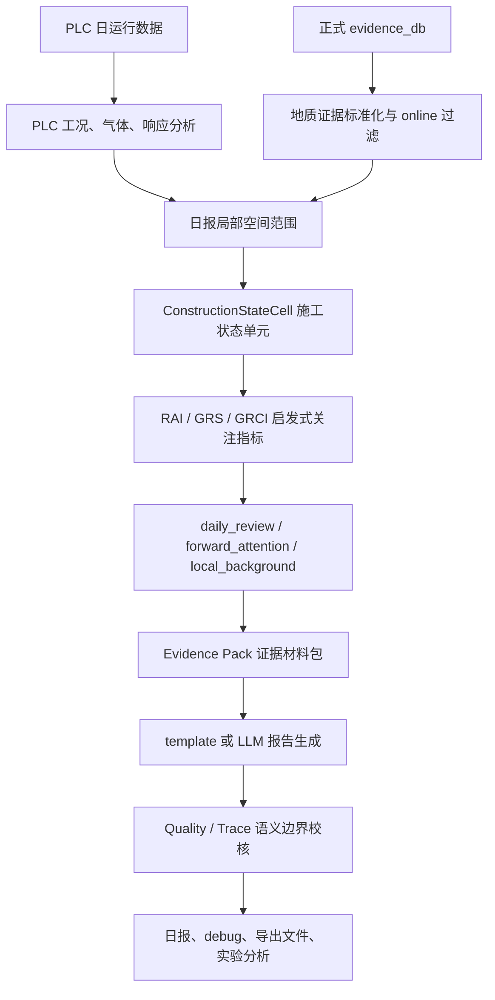

# TBM 日报后端项目深度理解手册

这份文档是给项目作者本人看的。它的目的不是替代字段契约、API 文档或论文草稿，而是把当前 TBM 日报后端到底在做什么、为什么这样做、每一步应该怎样理解讲清楚。

你可以把它当成一位导师给学生讲项目：少背字段名，多理解数据为什么这样流动；少记函数名，多理解每一层在解决什么问题。

## 0. 总览：这个项目到底是什么

这个项目不是让 LLM 凭空写 TBM 日报。它真正做的是先把 PLC 施工数据和多源地质证据整理成一个个局部施工状态单元，再计算几个启发式关注指标，然后把允许报告使用的材料打包成 Evidence Pack，最后让模板或 LLM 在证据约束下生成日报，并用 Quality / Trace 检查报告有没有乱写。

更直白一点说：

```text
原始 PLC 和地质证据很乱
-> 系统先把它们对齐到里程 cell
-> 每个 cell 都变成一个 ConstructionStateCell
-> 每个 cell 里同时装着施工响应、地质证据、追溯来源和关注指标
-> Evidence Pack 从这些 cell 里挑出日报需要写的材料
-> 报告生成器只能看 Evidence Pack
-> Quality / Trace 再检查报告里的话有没有证据支撑
```

所以，项目的核心价值不在“调用了 LLM”，而在“把工程数据整理成可追溯、可约束、可复核的日报证据链”。LLM 只是最后的语言表达模块。即使完全不用 LLM，template 模式也能生成一份受证据约束的日报，并通过 Quality / Trace 检查。

当前主线已经冻结。后续更应该做的是批量实验、尺度敏感性、权重敏感性、生成模式对比和典型日期复盘，而不是继续往主流程里堆新模块。

对应位置：主入口在 `pipeline/daily_report_pipeline.py`，API 入口在 `routes/report.py`，核心 cell 定义在 `schemas/pipeline.py`。

## 1. 一张总流程图讲清楚主线



这张图最重要的是两点。

第一，PLC 和地质证据不会直接扔给 LLM。它们先变成结构化、局部化、可追溯的 ConstructionStateCell。这样做是为了避免 LLM 在原始数据里“自由发挥”，也为了让每一句报告都能往回追溯。

第二，系统把证据分成三种角色。已掘区段用来复核地质-施工响应耦合，前方区段只做关注提示，背景区段只帮助理解附近环境。不同角色能写进报告的话不一样，这就是本项目避免“前方提示事实化”和“GRCI 概率化”的核心设计。

## 2. 目录和模块：哪些该看，哪些不要被带偏

理解项目时，优先看当前主流程，而不是 `_archive/` 或旧 Agent。

| 模块 | 它负责什么 | 作者应该怎么理解 | 是否参与主流程 |
|---|---|---|---|
| `routes/` | 对外 API，只保留日报和 debug 相关接口 | 前端或脚本从这里触发日报生成 | 是 |
| `pipeline/` | 串起每日输入、PLC、地质、cell、报告、检查和导出 | 项目的主控制层 | 是 |
| `plc/` | 把一天 PLC 数据变成工况、气体、响应和 cell_response | 负责“机器当天实际怎么运行” | 是 |
| `geology_v2/` | 标准化、过滤、投影、融合地质证据和 forward profile | 负责“已有地质证据提示什么” | 是 |
| `coupling/` | 构建 ConstructionStateCell，并计算 RAI / GRS / GRCI | 负责“把施工响应和地质证据放到同一个 cell 里” | 是 |
| `llm/` | Evidence Pack、prompt、模板、LLM 生成、Quality / Trace | 负责“怎么写报告，以及怎么检查报告” | 是 |
| `twin/` | 从 cell 汇总一个状态摘要 | 是 Evidence Pack 和 debug 的辅助表达 | 是 |
| `geology_text/` | P3 旁路式地质文本抽取 | 只产生候选证据，不进入正式日报 | 否 |
| `scripts/` | smoke、导出、批量、敏感性和旁路导出脚本 | 实验和复盘工具箱 | 部分调用主流程 |
| `_archive/` | 历史代码归档 | 只作参考，不要顺着它理解当前主线 | 否 |

作者真正理解项目时，建议先读这四类东西：主流程、ConstructionStateCell、Evidence Pack、Quality / Trace。其他模块都可以围绕这四类去理解。

## 3. 输入数据：系统到底吃什么

系统的正式输入主要有两类。

第一类是 PLC 日运行数据。它代表“机器当天事实上怎么运行”。它能告诉系统：当天里程从哪里到哪里，推进速度如何，推力和扭矩如何，停机多久，有没有异常工况标记，气体字段是否出现超限或报警。这些内容最后会变成 operation_summary、cluster_summary、gas_summary 和 cell_response_df。

第二类是正式地质 evidence_db。它代表“已有地质资料提示了什么”。这里包括 TSP、HSP、sonic 类超前地质资料、掌子面素描等。它们不是直接变成结论，而是先标准化为带里程、证据角色、地质标签和 source_trace 的记录，再进入时间可用性过滤和空间相关筛选。

还有第三类容易混淆的东西：P3 candidate evidence。P3 是旁路式 LLM 地质文本结构化模块。它可以把原始地质文本抽成候选证据，但这些候选证据必须人工复核，当前不写入正式 evidence_db，不进入 time_valid / spatial_relevant，不参与 GRS / GRCI，也不进入 Evidence Pack。

这条边界非常重要：当前系统使用的是正式 evidence_db，不是 LLM 临时抽取的候选证据。LLM 也不直接读取原始 PLC CSV 或完整 evidence_db，它只能消费 Evidence Pack。

对应位置：PLC 分析在 `plc/response.py`；地质证据主线在 `geology_v2/`；P3 旁路在 `geology_text/`。

## 4. 日报空间范围：实际推进范围和 cell 对齐范围不是一回事

这部分是最容易写错的地方。

PLC 实测推进范围，意思是当天 PLC 数据里真实记录到的最小和最大里程。这个范围对应实际施工推进事实。实际推进量也只能从这里算。

cell 对齐后的已掘复核范围，是系统为了按固定 10m cell 做分析，把实际里程范围向 cell 边界对齐后的范围。它服务于复核和建模，不等于当天真实推进范围。

以当前已有真实导出的 2023-12-30 为例：

| 项目 | 数值 | 解释 |
|---|---:|---|
| PLC 实测最小里程 | 1014601.0 | 当天 PLC 数据记录到的起点 |
| PLC 实测最大里程 | 1014616.0 | 当天 PLC 数据记录到的终点 |
| 实测推进量 | 15.0 m | 1014616.0 - 1014601.0 |
| 10m cell 对齐复核范围 | 1014600.0 到 1014620.0 | 为了覆盖当日施工范围而对齐到 cell |

所以报告可以写：

```text
PLC 实测推进范围为 1014601.0 至 1014616.0，日推进约 15.0 m。
系统按 10m cell 将已掘复核范围对齐为 1014600.0 至 1014620.0。
```

但报告不能写：

```text
本日由 1014600.0 推进至 1014620.0，共推进 20m。
```

后一句错在把 cell 对齐范围当成了实际推进范围。系统专门有 E14 检查这类错误。

当前默认 cell 是 10m。10m 是最大推荐日报复核尺度。5m / 10m 可以用于尺度敏感性分析；不默认用 20m，是因为 20m 会把太多局部变化揉在一起，日报复核解释性会变弱。

前方关注默认看当前掌子面前方 30m，并分成 0-10m、10-20m、20-30m 三层。越接近掌子面，越适合写成近期施工关注。

对应位置：日报范围在 `pipeline/evidence_scope.py` 中构建。

## 5. ConstructionStateCell：为什么它是整个项目的核心

PLC 是时间序列，地质证据是空间区段，日报是自然语言。如果不做中间层，三者粒度完全不一致。

ConstructionStateCell 就是这个中间层。你可以把它理解成“一个 10m 左右的施工空间小盒子”。每个盒子里放入：

- 这个 cell 在哪个里程段；
- 它属于已掘复核、前方关注还是局部背景；
- 当天 PLC 在这个 cell 里表现如何；
- 地质证据在这个 cell 里提示了什么；
- RAI、GRS、GRCI 是否可用；
- 支撑它的 evidence_id 和 source_trace；
- 它有没有被选入 Evidence Pack；
- 它为什么值得写进报告。

这就是为什么 ConstructionStateCell 是项目核心。它把“机器行为”“地质资料”和“报告文字”连起来。报告不是直接看原始数据写，而是看这些 cell 经过筛选和整理后的证据材料写。

一个 cell 不是永远都有所有指标。比如前方关注 cell 通常有地质证据和 GRS，但没有当日 PLC response，所以没有 RAI，也不能算正式 GRCI。局部背景 cell 可以有地质证据，但不是当天复核重点。只有 daily_review cell 同时有 PLC response、RAI、GRS 时，才可以计算 GRCI。

对应位置：定义在 `schemas/pipeline.py`，构建在 `coupling/grs_rai_grci.py`。

## 6. 三种 cell 角色：已掘复核、前方关注、局部背景

daily_review 表示已掘复核区段。它和当天 PLC 推进范围对齐，通常能拿到当天 PLC 响应，也能和地质证据放在一起复核。只有这里可以计算正式 GRCI。

forward_attention 表示当前掌子面前方关注区段。它回答的是：“前方已有可用地质证据提示什么，需要施工方关注什么？”它只能写提示、关注、建议复核，不能写已发生事实。它不计算 GRCI，因为前方 cell 没有当日 PLC response。

local_background 表示局部背景。它帮助理解附近地质环境，但不作为当天强结论，不进入 high GRCI。

2023-12-30 的真实导出里：

| 角色 | 数量 | 说明 |
|---|---:|---|
| daily_review | 2 | 对齐后的已掘复核 cell |
| forward_attention | 3 | 当前掌子面前方 30m 内 cell |
| local_background | 9 | 后方 100m 局部背景 cell |
| construction_state_cells 总数 | 14 | 日报局部范围内的全部 cell |

这套分层的目的，是防止报告把不同语义的证据混在一起。high GRCI 只能来自 daily_review。forward_attention 不能进入 high GRCI，也不能写成已发生事实。

## 7. RAI：施工响应关注度怎么理解

RAI 表示 PLC 数据表现出来的施工响应关注程度。它不是事故原因，不是灾害概率，也不是异常停机判断器。

当前公式是：

```text
RAI =
0.40 * stop_ratio
+ 0.25 * abnormal_ratio
+ 0.20 * speed_drop_score
+ 0.10 * torque_volatility_score
+ 0.05 * speed_volatility_score
```

每一项的工程含义是：

- 停机比例高，说明这个 cell 施工响应值得关注，但不等于异常停机；
- 异常工况比例高，说明运行状态中异常标记较多；
- 推进速度下降，说明推进效率可能有变化；
- 扭矩波动，说明机械响应不稳定；
- 速度波动，说明推进过程不够平稳。

这里最重要的边界是 stop_ratio。当前 PLC 字段没有区分计划停机和非计划停机，所以不能把 stop_ratio 高直接写成“异常停机原因”。它只能写作施工响应关注信号。

2023-12-30 的两个 daily_review cell 里：

| cell | stop_ratio | abnormal_ratio | speed_drop_score | RAI | dominant_component |
|---|---:|---:|---:|---:|---|
| cell_1014600_1014610 | 0.7932 | 0.0011 | 1.0 | 0.5175 | stop_component |
| cell_1014610_1014620 | 0.6154 | 0.0039 | 1.0 | 0.4471 | stop_component |

这说明这两个 cell 的施工响应确实值得复核，但不能把它们直接解释为“异常停机导致”。

对应位置：RAI 的 cell 聚合在 `plc/cell_response.py`，最终进入 `coupling/grs_rai_grci.py`。

## 8. GRS：地质证据关注度怎么理解

GRS 表示已有地质证据对某个 cell 的关注提示程度。它不是灾害概率，不是现场已揭露事实，也不是“地质一定很差”的断言。

当前公式是：

```text
GRS_geo_base =
0.45 * grade_score_component
+ 0.45 * hazard_component
+ 0.10 * confidence_component
```

这里的三个部分可以这样理解：

- 围岩等级关注：围岩等级越差，地质关注一般越高；
- hazard 关注：如果证据中有破碎岩体、掉块、裂隙密集、软硬不均、反射异常等标签，关注会升高；
- 置信度关注：表达证据本身的可靠程度。

一个非常重要的细节是：GRS 为 0 不一定代表“地质很好”。它也可能代表“没有可用空间相关地质证据”。所以解释 GRS 时必须看 GRS_available 和 has_geology_evidence。

新增的 overlap、trace completeness、source reliability 等字段主要帮助解释证据和 cell 的关系。它们让作者知道“这条证据为什么能支撑这个 cell”，但默认不改变 GRS 的公式。

对应位置：地质融合在 `geology_v2/fusion_engine.py`，字段进入 ConstructionStateCell 后在 `coupling/grs_rai_grci.py` 中统一组织。

## 9. GRCI：地质-施工响应耦合关注度怎么理解

GRCI 是已掘区段复核指标。它表达的是“地质证据关注”和“施工响应关注”是否在同一个已掘 cell 中同时出现。

它不是灾害概率，不是前方风险，也不是因果证明。

当前公式是：

```text
GRCI =
0.55 * GRS_geo_base
+ 0.35 * RAI
+ 0.10 * GRS_geo_base * RAI
```

三项的意思是：

- 第一项强调地质证据关注；
- 第二项强调施工响应关注；
- 第三项表达二者同时较高时的交互增强。

正式 GRCI 只有在以下条件同时满足时才计算：

- cell 是 daily_review；
- 有可用地质证据和 GRS；
- 有当日 PLC response；
- 有 RAI。

2023-12-30 的两个可用 GRCI cell 是真实导出值：

| cell | GRS | RAI | GRCI | coupling_level |
|---|---:|---:|---:|---|
| cell_1014600_1014610 | 0.5753 | 0.5175 | 0.5273 | medium |
| cell_1014610_1014620 | 0.6119 | 0.4471 | 0.5204 | medium |

例如第一个 cell：

```text
0.55 * 0.5753 + 0.35 * 0.5175 + 0.10 * 0.5753 * 0.5175
= 约 0.5273
```

这个 0.5273 的意思是“已掘复核区段中，地质证据关注和施工响应关注存在一定耦合，值得复核”。它绝对不能写成“灾害概率 52.73%”。

## 10. 新增解释性字段：为什么它们存在，但不是主公式

方法增强第一稳定版加了一些解释性字段。它们不是为了替代 RAI / GRS / GRCI，而是为了让输出更容易复盘。

cell_size_m 用来说明本次运行使用的 cell 尺度。默认是 10m。5m / 10m 用于尺度敏感性分析。

overlap 相关字段用来说明某条地质证据到底覆盖了 cell 的多少。它解决的是“证据为什么能投影到这个 cell”的解释问题。

forward distance 字段用来说明前方关注 cell 离当前掌子面多远。0-10m 比 20-30m 更接近近期施工关注。

confidence / reliability 字段用来保存证据本身已有的置信或来源可靠性。如果原始数据没有，系统不会伪造一个精确置信度。

trace completeness 表示追溯链完整不完整。一个报告 claim 可信不可信，很大程度取决于它能不能追到 evidence_id、source_type 和原始片段。

selection_score、selection_rank、selection_reason 说明某个 cell 为什么被选进 Evidence Pack。daily_review 的 selection 可以看 GRCI / RAI / GRS / trace；forward_attention 明确不看 GRCI，只看 GRS、距离、证据质量和 trace。

## 11. Evidence Pack：报告生成模型真正看到的材料包

Evidence Pack 就像给写日报的人准备的一包材料。它不是原始数据库，而是已经筛过、分层过、带约束的证据材料。

它会告诉报告生成器：

- 今天 PLC 实测推进范围是多少；
- 哪些 daily_review cell 可以做 GRCI 复核；
- 哪些 forward_attention cell 只能写前方关注提示；
- 哪些 local_background cell 只能当背景；
- 哪些话禁止写，比如不能把 GRCI 写成概率；
- 每个关键 cell 的 source_trace 是什么；
- 哪些 cell 为什么被选中。

LLM 如果启用，也只能看 Evidence Pack。它不直接看原始 PLC，不直接看完整 evidence_db，不自己计算 RAI / GRS / GRCI，也不自己决定 forward cell。

2023-12-30 的真实 Evidence Pack 里，key_cells 数量为 13。前几个 key cells 是：

| cell | role | selection_score | rank | selection_reason |
|---|---|---:|---:|---|
| cell_1014600_1014610 | daily_review | 0.5841 | 1 | GRCI=0.527, RAI=0.518, GRS=0.575, trace=1.000 |
| cell_1014610_1014620 | daily_review | 0.5729 | 2 | GRCI=0.520, RAI=0.447, GRS=0.612, trace=1.000 |
| cell_1014620_1014630 | forward_attention | 0.7386 | 1 | GRS=0.535, forward_distance_weight=1.000, trace=1.000 |
| cell_1014630_1014640 | forward_attention | 0.6573 | 2 | GRS=0.557, forward_distance_weight=0.700, trace=1.000 |
| cell_1014640_1014650 | forward_attention | 0.5217 | 3 | GRS=0.483, forward_distance_weight=0.400, trace=1.000 |

注意这里 forward_attention 的 selection_reason 没有 GRCI，因为前方 cell 不算 GRCI。

对应位置：Evidence Pack 构建在 `llm/evidence_pack.py`。

## 12. 报告生成：template、LLM、planner、revision 分别是什么

当前系统支持多种生成模式。

template 是最稳定的 no-LLM 基线。它不用外部模型，适合回归测试、批量实验和方法验证。

evidence_pack_llm 是直接把 Evidence Pack 转成 prompt 交给 LLM，让 LLM 在证据约束下写正文。

evidence_pack_llm_with_revision 是先生成初稿，再用 Quality / Trace 的反馈进行修订。

evidence_pack_planner_llm 是先让 planner 规划章节和证据角色，再生成正文。planner 的意义是让模型先决定每一节该用哪类证据，减少 forward 和 daily_review 混用。

evidence_pack_planner_llm_with_revision 是 planner、生成、检查、修订的完整链路。

默认 no-LLM template 用于稳定实验。mock LLM 用于安全测试。真实外部 LLM 需要显式允许。LLM 不是方法全部，证据组织和质量校核才是项目底座。

## 13. Quality / Trace：系统如何检查报告有没有胡写

Quality / Trace 的作用，是把报告里的句子拆成 claim，然后检查这些 claim 是否能在 Evidence Pack、key cells、source_trace 或 generation constraints 中找到支撑。

它防的不是语法错误，而是工程语义错误：

- 把 GRCI 写成灾害概率；
- 把 forward_attention 写成已发生事实；
- 把 daily_excavated_scope 写成实际推进范围；
- 把 stop_ratio 写成异常停机原因；
- 写出 Evidence Pack 中没有支撑的技术判断。

2023-12-30 的真实质量结果：

| 指标 | 数值 |
|---|---:|
| quality_score | 100 |
| claim_count | 22 |
| grounded_claim_count | 22 |
| unsupported_claim_count | 0 |
| grounding_rate | 1.0 |

trace 侧的 claim 数与 quality 侧略有不同，因为 trace 会再过滤一部分非追溯性句子。2023-12-30 中，trace 识别 raw claim 45 条，排除非追溯句 23 条，形成 claim_trace 19 条，unsupported 为 0。

这说明报告不是“看起来像日报”就完了，还要能追溯、能解释、能避免常见误写。

对应位置：质量检查在 `llm/report_quality_checker.py`，追溯构建在 `llm/report_trace_builder.py`。

## 14. allowed_claims 旁路导出：为什么现在只旁路

allowed_claims 是系统根据 Evidence Pack 整理出的“允许报告写的事实或判断清单”。它可以帮助作者理解报告边界，也可以作为未来 claim-first generation 的材料。

但它当前只做旁路导出，不接入默认生成流程。原因很简单：claim-first generation 是另一个更强约束的生成范式，如果直接接入主流程，会改变现有报告生成行为。当前阶段主线已经冻结，所以 allowed_claims 只作为研究和复盘材料。

2023-12-30 的旁路导出中，allowed_claims 数量为 12，且 `enable_claim_first=false`。这说明它确实只是导出材料，不是默认生成步骤。

对应位置：脚本在 `scripts/export_allowed_claims.py`。

## 15. P3 旁路地质文本结构化：为什么不直接进入主链路

P3 的作用是把原始地质文本抽成候选 evidence。它很有用，但不能直接进入正式日报主链路。

原因是 LLM 抽取可能出错。地质文本里的里程、围岩等级、掉块、反射异常等信息，一旦抽错，后面 GRS、forward_attention、报告结论都会被污染。所以 P3 输出必须标记为 candidate_only、requires_manual_review、not_used_by_main_pipeline。

当前正式日报只使用正式 evidence_db。P3 是扩展材料生产工具，不是正式证据源。

对应位置：P3 在 `geology_text/`，说明文档是 `docs/geology_text_extraction.md`。

## 16. 贯穿案例：2023-12-30 一份日报是怎么来的

这一节使用当前已有真实导出，不是示意值。导出目录是：

```text
backend/outputs/pipeline_exports/2023-12-30/
```

### 16.1 用户请求这一天的日报

输入日期是 2023-12-30。系统会读取这一天的 PLC 日运行 CSV，同时读取正式 evidence_db。然后主流程开始把二者整理到同一个日报局部空间范围。

### 16.2 PLC 告诉系统当天实际推进了多少

真实导出显示：

| 项目 | 数值 |
|---|---:|
| daily_chainage_min | 1014601.0 |
| daily_chainage_max | 1014616.0 |
| daily_advance_m | 15.0 |
| current_chainage | 1014616.0 |

所以当天实际推进是 15m。这个事实来自 PLC，不来自 cell 对齐。

PLC 分析还生成了两个 cell_response_df 行：

| cell | RAI | stop_ratio | abnormal_ratio | speed_drop_score |
|---|---:|---:|---:|---:|
| cell_1014600_1014610 | 0.5175 | 0.7932 | 0.0011 | 1.0 |
| cell_1014610_1014620 | 0.4471 | 0.6154 | 0.0039 | 1.0 |

这两个 cell 是当天已掘复核范围内有 PLC response 的 cell。

### 16.3 地质证据先过时间，再过空间

2023-12-30 的真实 scope_summary：

| 项目 | 数值 |
|---|---:|
| time_valid_evidence_count | 198 |
| spatial_relevant_evidence_count | 18 |
| excluded_by_distance_evidence_count | 180 |
| excluded_by_time_evidence_count | 0 |
| cell_evidence_row_count | 82 |

这说明：系统先保留了报告日期前可用的 198 条证据，然后只把和日报局部空间范围相关的 18 条证据拿进主链路，180 条距离太远的证据被排除。这个步骤就是防止旧远距离 TSP 或不相关地质资料污染当天日报。

### 16.4 系统建立日报局部 cell

2023-12-30 的范围：

| 范围 | 起点 | 终点 |
|---|---:|---:|
| daily_excavated_scope | 1014600.0 | 1014620.0 |
| forward_scope | 1014620.0 | 1014650.0 |
| local_background_scope | 1014510.0 | 1014600.0 |
| report_scope | 1014510.0 | 1014650.0 |

最终得到 14 个 ConstructionStateCell：

| 角色 | 数量 |
|---|---:|
| local_background | 9 |
| daily_review | 2 |
| forward_attention | 3 |

注意 daily_excavated_scope 的 1014600.0 到 1014620.0 是对齐范围，不是实际推进 20m。

### 16.5 daily_review 计算 RAI、GRS、GRCI

两个 daily_review cell 都有 GRS、RAI 和 PLC response，因此可以计算正式 GRCI。

| cell | GRS | RAI | GRCI | 解释 |
|---|---:|---:|---:|---|
| cell_1014600_1014610 | 0.5753 | 0.5175 | 0.5273 | 中等复核关注 |
| cell_1014610_1014620 | 0.6119 | 0.4471 | 0.5204 | 中等复核关注 |

这两个 cell 同时具备地质证据关注和施工响应关注，所以进入已掘区段地质-施工响应复核。它们是 high_grci_cells 中的两个复核 cell，但这里的 high_grci_cells 是历史兼容字段名，严格 high priority 需要看 priority 分组；2023-12-30 两个 cell 的 coupling_level 都是 medium。

### 16.6 forward_attention 只做前方关注提示

当前掌子面是 1014616.0，前方 30m 内有三个 forward_attention cell：

| cell | distance_to_face_m | distance band | GRS | GRCI_available |
|---|---:|---|---:|---|
| cell_1014620_1014630 | 9.0 | near_forward | 0.5353 | false |
| cell_1014630_1014640 | 19.0 | short_forward | 0.5575 | false |
| cell_1014640_1014650 | 29.0 | extended_forward | 0.4831 | false |

forward_profile 也显示 0-10m、10-20m、20-30m 三个窗口，整体前方关注等级为 medium。它们可以写成“当前掌子面前方关注提示”，不能写成“前方已经发生异常”，也不能使用 GRCI。

### 16.7 Evidence Pack 选择关键 cell

Evidence Pack 不是把所有东西都丢给报告生成器，而是挑出最适合写进日报的 key cells。

2023-12-30 的 key_cells 数量为 13。前几个 key cells 的真实 selection 信息如下：

| cell | role | selection_score | rank | 为什么被选中 |
|---|---|---:|---:|---|
| cell_1014600_1014610 | daily_review | 0.5841 | 1 | GRCI、RAI、GRS 和 trace 都较完整 |
| cell_1014610_1014620 | daily_review | 0.5729 | 2 | 同样具备 GRCI、RAI、GRS 和 trace |
| cell_1014620_1014630 | forward_attention | 0.7386 | 1 | 前方近、GRS 有关注、trace 完整 |
| cell_1014630_1014640 | forward_attention | 0.6573 | 2 | 前方较近、GRS 有关注、trace 完整 |
| cell_1014640_1014650 | forward_attention | 0.5217 | 3 | 前方 20-30m、GRS 有关注、trace 完整 |

这里你可以看到角色差异：daily_review 的选择理由可以包含 GRCI；forward_attention 的选择理由没有 GRCI。

### 16.8 报告生成与检查

2023-12-30 当前导出使用的是 template 模式，质量结果为：

| 指标 | 数值 |
|---|---:|
| quality_score | 100 |
| grounding_rate | 1.0 |
| claim_count | 22 |
| grounded_claim_count | 22 |
| unsupported_claim_count | 0 |
| E14_ALIGNED_SCOPE_AS_ACTUAL_ADVANCE | 0 |
| E13_STOP_REASON_OVERINTERPRETATION | 0 |
| E3_GRCI_AS_PROBABILITY | 0 |

这说明报告没有把对齐范围写成实际推进，没有把 stop_ratio 写成异常停机原因，也没有把 GRCI 写成概率。

### 16.9 最终导出怎么读

如果你只看 `report.txt`，其实看不到方法本体。真正理解这一天，建议按下面顺序看：

1. `summary.json`：先看总体结果是否正常；
2. `scope_summary.json`：看实际推进范围、对齐范围、前方范围；
3. `construction_state_cells.csv`：看每个 cell 的 RAI / GRS / GRCI 和角色；
4. `high_grci_cells.json`：看已掘复核 cell；
5. `forward_profile.json`：看前方关注提示；
6. `evidence_pack.json`：看报告生成器真正看到的材料；
7. `report.txt`：看最终日报文本；
8. `quality.json` 和 `trace.json`：看报告是否有证据支撑；
9. `method_metrics.json`：看后续实验统计用的指标。

如果跑了 `export_allowed_claims.py`，还可以看 `allowed_claims.json`，理解系统允许报告写哪些 claim。

## 17. 实验到底要证明什么

后续实验不是为了证明“系统能预测灾害”。当前没有灾害发生标签、异常原因标签或现场复核标签，所以不做监督学习式权重校准，也不做灾害预测准确率。

91 天批量运行稳定性，是证明系统不是单日 demo，而是能连续运行。

generation mode 对比，是看 Evidence Pack、planner、revision 对报告 grounding 和错误减少是否有帮助。

Quality / Trace 错误分析，是证明系统能识别无证据 claim、数值乱写、前方事实化、GRCI 概率化等问题。

GRCI 权重敏感性，是看启发式权重变化时，关注排序是否稳定。它不是训练权重。

5m / 10m cell 尺度敏感性，是看 cell 尺度变化对复核单元数量、GRCI 可用性和报告质量的影响。

典型日期案例复盘，是证明系统可以从原始数据一路追到报告 claim。

可选人工评价，是让工程人员判断报告是否有用、表达是否保守、证据引用是否可信。

## 18. 常见误解和正确理解

| 误解 | 正确理解 |
|---|---|
| 这是直接用 LLM 写日报 | 不是，LLM 只消费 Evidence Pack |
| GRCI 是灾害概率 | 不是，它是已掘区段耦合复核关注度 |
| forward_attention 表示前方已经发生异常 | 不是，它只是前方关注提示 |
| daily_excavated_scope 是实际推进范围 | 不是，它是 cell 对齐复核范围 |
| stop_ratio 高就是异常停机 | 不能这么说，PLC 未区分计划/非计划停机 |
| P3 抽取结果会自动进入日报 | 不会，P3 是旁路候选证据 |
| allowed_claims 已经接入主生成 | 没有，它只是旁路导出 |
| 权重敏感性是在训练权重 | 不是，只是稳定性检验 |
| local_background 可以当当天结论写 | 不可以，它只提供背景 |
| forward cell 可以算 GRCI | 不可以，forward 没有当日 PLC response |
| LLM 可以直接看 evidence_db | 不可以，LLM 只看 Evidence Pack |
| GRS 为 0 就说明地质很好 | 不一定，可能是没有可用地质证据 |
| high_grci_cells 等于严格高风险 | 不等于，它是复核关注列表，严格等级还要看 priority / coupling_level |
| 10m 对齐范围可以用来算日推进量 | 不可以，日推进量来自 PLC raw range |
| Quality / Trace 是形式检查 | 不只是形式，它检查工程语义边界和证据支撑 |

## 19. 作者接下来应该怎么做

当前阶段最重要的是稳定住方法，不要再继续改主线。建议顺序是：

1. 确认当前版本冻结；
2. 跑 91 天 batch pipeline；
3. 跑 batch metrics；
4. 跑 5m / 10m cell size 敏感性；
5. 跑 GRCI weight sensitivity；
6. 跑 generation mode comparison；
7. 选择典型日期；
8. 做案例复盘；
9. 必要时做人工评价；
10. 再开始写论文实验章节。

## 附录 A：关键字段速查

| 字段 | 人话解释 |
|---|---|
| `daily_plc_range` | PLC 实测推进范围 |
| `daily_advance_m` | PLC 实测日推进量 |
| `daily_excavated_scope` | cell 对齐后的已掘复核范围 |
| `ConstructionStateCell` | 把 PLC、地质证据和报告追溯接起来的 cell |
| `RAI` | 施工响应启发式关注指标 |
| `GRS_geo_base` | 地质证据启发式关注指标 |
| `GRCI` | 已掘区段地质-施工响应耦合复核关注指标 |
| `daily_review` | 已掘复核 cell |
| `forward_attention` | 当前掌子面前方关注 cell |
| `local_background` | 局部背景 cell |
| `selection_score` | cell 进入 Evidence Pack 的选择分 |
| `source_trace` | 报告 claim 追溯到证据的链 |

## 附录 B：关键脚本速查

| 脚本 | 用途 |
|---|---|
| `smoke_test_daily_pipeline.py` | 快速验证一个或多个日期能否跑通 |
| `export_daily_pipeline_outputs.py` | 导出某些日期的完整中间结果 |
| `run_batch_pipeline.py` | 多日期批量跑主 pipeline |
| `run_batch_llm_generation.py` | 多日期批量跑生成模式 |
| `analyze_batch_metrics.py` | 汇总批量指标 |
| `analyze_generation_modes.py` | 对比生成模式 |
| `analyze_grci_weight_sensitivity.py` | GRCI 权重敏感性 |
| `analyze_cell_size_sensitivity.py` | 5m / 10m cell 尺度敏感性 |
| `export_allowed_claims.py` | 旁路导出 allowed claims |
| `run_geology_text_extraction.py` | P3 旁路地质文本抽取 |

## 附录 C：代码位置速查

| 位置 | 看什么 |
|---|---|
| `pipeline/daily_report_pipeline.py` | 主流程如何串起来 |
| `pipeline/evidence_scope.py` | 日报范围和证据角色怎么定 |
| `plc/response.py` | PLC 分析入口 |
| `plc/cell_response.py` | PLC response 怎么聚合到 cell |
| `geology_v2/` | 地质证据标准化、过滤、投影、融合 |
| `coupling/grs_rai_grci.py` | ConstructionStateCell、RAI/GRS/GRCI 组装 |
| `llm/evidence_pack.py` | Evidence Pack 和模板报告 |
| `llm/report_quality_checker.py` | Quality 检查 |
| `llm/report_trace_builder.py` | Trace 构建 |
| `geology_text/` | P3 旁路候选证据模块 |
