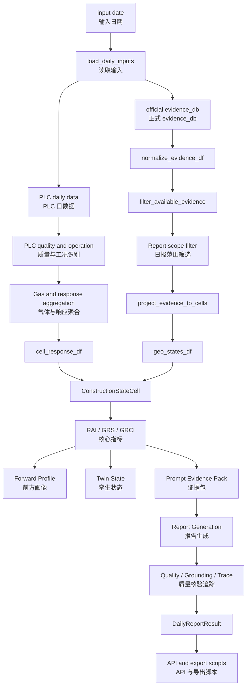
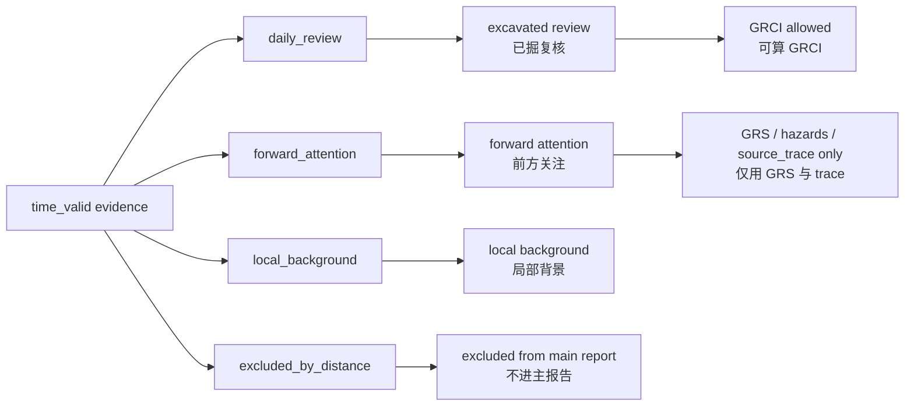
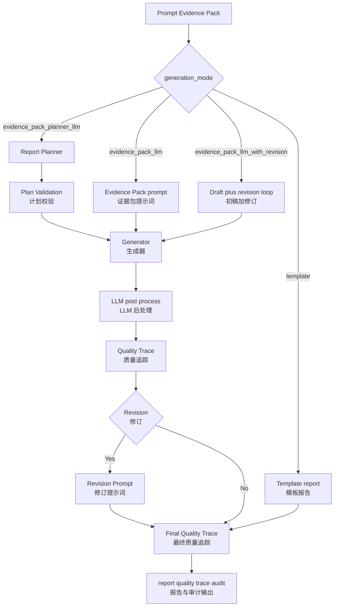
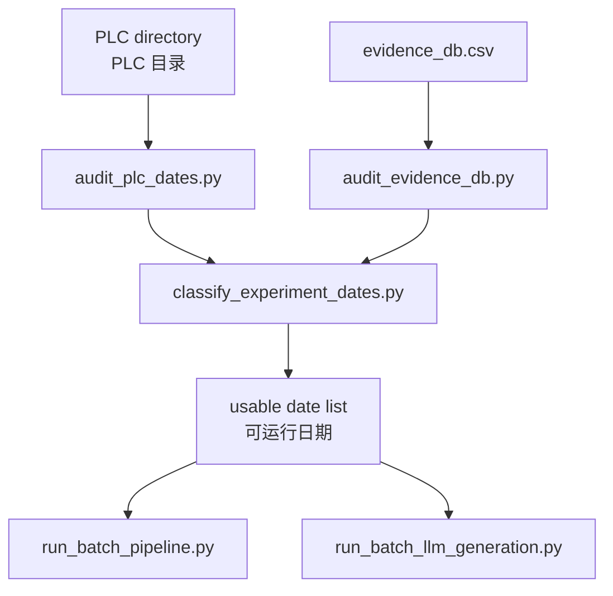
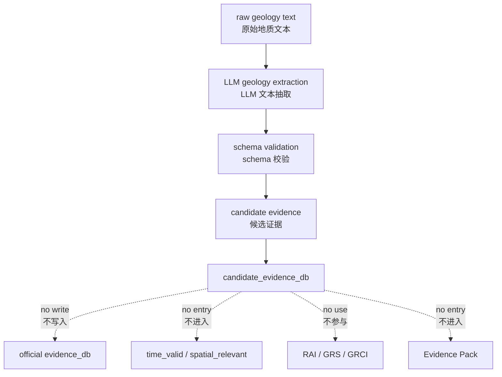

# TBM 日报后端系统架构

本文描述当前代码真实执行的后端架构。旧 Agent、旧 `routes/tbm.py`、旧 segment 级 GRCI、旧 history memory 和 `_archive/` 中的历史代码都不参与本文所述主流程。

相关文档：

- [字段契约](backend_field_contract.md)
- [方法与计算逻辑白皮书](method_calculation_whitepaper.md)
- [LLM 生成模式](llm_generation_modes.md)
- [批量审计与多日期运行](batch_pipeline.md)
- [方法增强说明](method_enhancement.md)
- [实验与复盘脚本说明](experiment_scripts.md)
- [旁路式地质文本结构化](geology_text_extraction.md)

当前方法主线已经冻结，后续工作进入实验与复盘阶段。旁路分析脚本、P3 candidate evidence 和 allowed claims 导出均不改变本文所述默认主流程。

## 1. 当前唯一日报主链路

```text
FastAPI routes.report
-> run_daily_report_pipeline
-> ConstructionStateCell
-> Evidence Pack
-> template / evidence_pack_llm / evidence_pack_llm_with_revision / evidence_pack_planner_llm
-> Quality / Trace
-> Report / Debug / Export
```

代码入口：

- API 注册：`backend/app.py`
- API 路由：`backend/routes/report.py`
- 主函数：`backend/pipeline/daily_report_pipeline.py::run_daily_report_pipeline`
- 核心 cell schema：`backend/schemas/pipeline.py::ConstructionStateCell`

## 2. 主流程结构图



## 3. 证据范围分层

当前日报不再保留全局地质 cell 作为主流程，而是围绕当日施工范围和当前掌子面构建局部日报 cell。



语义边界：

- `daily_review`：已掘区段复核，只有同时具备 GRS、RAI 和 PLC response 的 cell 才能计算正式 GRCI。
- `forward_attention`：当前掌子面前方关注提示，不使用 GRCI，不写成已发生事实。
- `local_background`：只提供局部背景上下文，不进入 high GRCI。
- `excluded_by_distance`：距离当日报告范围过远，不进入日报主链路。

## 4. LLM 生成链路



LLM 只能消费 Evidence Pack 和经过验证的 planner 结果。LLM 不读取原始 PLC，不读取完整 evidence_db，不计算 RAI、GRS、GRCI，也不决定 forward cell。

## 5. 批量审计与多日期运行



批量脚本只调用现有单日 pipeline，不改变单日 pipeline 的计算逻辑。

## 6. P3 旁路式地质文本结构化



P3 定位为 sidecar candidate evidence module：

- 不写入正式 `evidence_db.csv`；
- 不进入正式 `time_valid / spatial_relevant`；
- 不参与 GRS、RAI、GRCI；
- 不进入 Evidence Pack；
- 不影响 Report 生成；
- 输出必须标记 `candidate_only=true`、`requires_manual_review=true`、`not_used_by_main_pipeline=true`。

## 7. 目录职责

- `routes/`：当前 API，只保留日报与调试接口。
- `pipeline/`：单日主 pipeline、输入、输出和 evidence scope。
- `plc/`：PLC 工况、响应、气体和 cell response 聚合。
- `geology_v2/`：正式地质证据标准化、过滤、投影、融合和 forward profile。
- `coupling/`：cell 级 RAI / GRS / GRCI 计算和语义边界。
- `twin/`：从 ConstructionStateCell 构建孪生状态摘要。
- `llm/`：Evidence Pack、prompt、planner、模板报告、LLM 调用、质量检查、grounding 与 trace。
- `geology_text/`：P3 旁路候选地质文本结构化。
- `scripts/`：smoke、导出、批量审计、批量运行、LLM 生成、P3 抽取。
- `tests/`：字段契约、语义边界、质量检查、批量脚本和 P3 sidecar 的回归测试。
- `docs/`：当前有效文档。
- `_archive/`：历史代码归档，不允许主流程 import。

## 8. 关键语义边界

- `daily_plc_range` 是 PLC 实测当日推进范围。
- `daily_excavated_scope` 是 10m cell 对齐后的已掘复核范围，不能写成实际推进范围。
- `GRCI` 是地质-施工响应耦合关注度，不是灾害概率，也不是前方风险。
- 没有 RAI 或没有 PLC response 的 cell 不计算正式 GRCI。
- forward cell 不进入 high GRCI。
- `stop_ratio` 只是施工响应关注信号；当前 PLC 字段未区分计划停机与非计划停机，不能把停机直接写成异常原因。
- 前方关注提示来自当前掌子面前方可用地质证据，只能写成关注/提示，不得写成已揭露事实。
