# TBM 项目结构图汇总

> 本文件基于 [PROJECT_METHOD_EXPLANATION_FOR_REVIEWER.md](./PROJECT_METHOD_EXPLANATION_FOR_REVIEWER.md) 绘制，用于快速理解项目结构、数据流、PLC 处理、证据治理、LLM 闭环和评价体系。
>
> 为避免 Mermaid 在部分平台渲染失败，每张图先给出纯文本版，再给出 Mermaid 版。纯文本版任何环境都能直接阅读。

---

## 图 1：项目总体七层架构

### 纯文本版

```text
┌──────────────────────────────────────────────┐
│ 第 7 层：审计评价层                           │
│ Quality / Grounding / Boundary / Trace        │
└──────────────────────────────────────────────┘
                    ▲
┌──────────────────────────────────────────────┐
│ 第 6 层：报告生成层                           │
│ Template / LLM Generator / Planner / Reviser  │
└──────────────────────────────────────────────┘
                    ▲
┌──────────────────────────────────────────────┐
│ 第 5 层：证据包层                             │
│ Evidence Pack：角色化、可追溯、带边界的材料包  │
└──────────────────────────────────────────────┘
                    ▲
┌──────────────────────────────────────────────┐
│ 第 4 层：施工状态孪生层                       │
│ DailyConstructionTwin                         │
└──────────────────────────────────────────────┘
                    ▲
┌──────────────────────────────────────────────┐
│ 第 3 层：状态单元层                           │
│ 10 m ConstructionStateCell                    │
└──────────────────────────────────────────────┘
                    ▲
┌──────────────────────────────────────────────┐
│ 第 2 层：数据治理层                           │
│ PLC 预处理 / 地质时间过滤 / 空间筛选 / 角色划分 │
└──────────────────────────────────────────────┘
                    ▲
┌──────────────────────────────────────────────┐
│ 第 1 层：原始数据层                           │
│ PLC 日运行 CSV / 地质 PDF→正式 evidence_db / 气体字段 │
└──────────────────────────────────────────────┘
```

### Mermaid 版

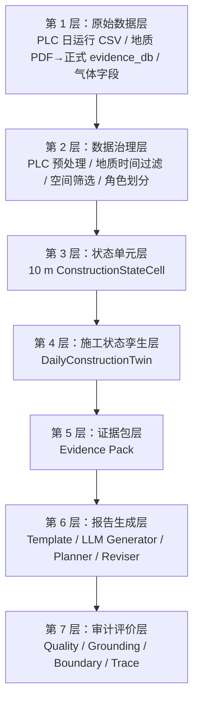

---

## 图 2：主流程数据流

### 纯文本版

```text
PLC 日运行数据                  TSP/HSP/掌子面素描 PDF
      │                                      │
      │                                      ▼
      │                              地质库建立脚本
      │                                      │
      │                                      ▼
      │                              正式 evidence_db
      │                                      │
      ▼                                      ▼
PLC 预处理与施工响应分析              地质证据标准化
      │                                      │
      │                                      ├─ 时间可用过滤
      │                                      ├─ 空间相关筛选
      │                                      └─ 证据角色划分
      │
      ▼
cell_response_df
      │
      ├─────────────────────┐
      ▼                     ▼
10 m 里程 cell          geo_states_df
      │                     │
      └──────────┬──────────┘
                 ▼
        ConstructionStateCell
                 ▼
        DailyConstructionTwin
                 ▼
        Evidence Pack
                 ▼
    Template / LLM / Planner / Reviser
                 ▼
Quality + Grounding + Boundary + Structured Trace
                 ▼
 Report / Debug / Export / Experiments / Paper Materials
```

### Mermaid 版

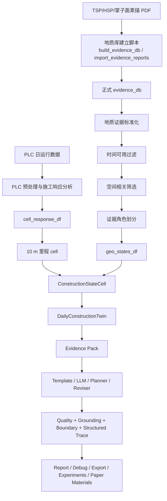

---

## 补充图 2A：地质证据库建立流程

### 纯文本版

```text
原始地质资料
│
├─ TSP 超前地质预报 PDF
├─ HSP / sonic 水平声波 PDF
└─ 掌子面素描 PDF
      │
      ▼
PDF 收集与来源识别
      │
      ├─ 全量重建：backend/scripts/build_evidence_db.py
      └─ 增量导入：backend/scripts/import_evidence_reports.py
            │
            ▼
规则解析器
      │
      ├─ parse_tsp_pdf
      ├─ parse_hsp_pdf
      └─ parse_sketch_pdf
            │
            ▼
EvidenceRecord 标准记录
      │
      ├─ evidence_id：证据编号
      ├─ source_type：来源类型
      ├─ source_level：证据层级
      ├─ report_date / issue_date：报告时间
      ├─ start_num / end_num：覆盖里程
      ├─ face_num / next_forecast_num：掌子面和下一预报里程
      ├─ confidence：证据置信信息
      ├─ attrs_json：围岩、异常、hazard、parser metadata
      └─ raw_text：原始文本片段
            │
            ▼
证据表清洗
      │
      ├─ 删除重复 evidence_id
      ├─ 删除缺失里程记录
      ├─ 删除起终点反向记录
      ├─ segment 长度限制为 0-300 m
      └─ 按来源、报告、里程排序
            │
            ▼
正式 evidence_db.csv
            │
            ├─ 同步 SQLite evidence_records
            ├─ audit_evidence_db.py 做证据库审计
            └─ 后续主 pipeline 只读取正式 evidence_db

旁路 LLM 地质文本抽取
      │
      └─ run_geology_text_extraction.py
            └─ 只输出 candidate evidence，不自动进入正式 evidence_db
```

### Mermaid 版

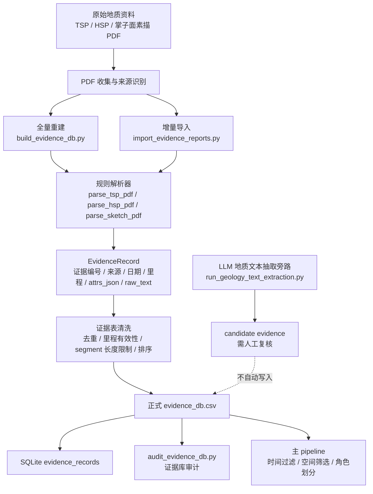

---

## 图 3：PLC 预处理与施工响应证据构建

### 纯文本版

```text
原始 PLC 样本
      │
      ▼
时间质量检查
      │   检查时间倒序、时间间隔异常、长时间断点
      ▼
里程质量检查
      │   检查里程反向、突跳、缺失、无法映射到 cell
      ▼
停机样本识别
      │   shutdown_i = 推力 <= 0 或 扭矩 <= 0
      ▼
非停机样本 3σ 异常标记
      │   x_i < mean - 3std 或 x_i > mean + 3std
      ▼
有效掘进样本识别
      │   非停机、非异常、核心字段有效、里程有效
      ▼
连续有效掘进区间切分
      │   最小样本数 20，最小持续时间 30 秒
      ▼
稳态段识别
      │   rolling mean window = 20
      │   threshold = 0.8 × rolling median
      ▼
10 m cell 稳态指标汇总
      │
      ├─ steady_speed_mean / cv
      ├─ steady_thrust_mean / cv
      ├─ steady_torque_mean / cv
      ├─ steady_rpm_mean / cv
      ├─ steady_penetration_mean / cv
      ├─ cutterhead_power_proxy
      └─ thrust_per_penetration / torque_per_penetration
```

### Mermaid 版

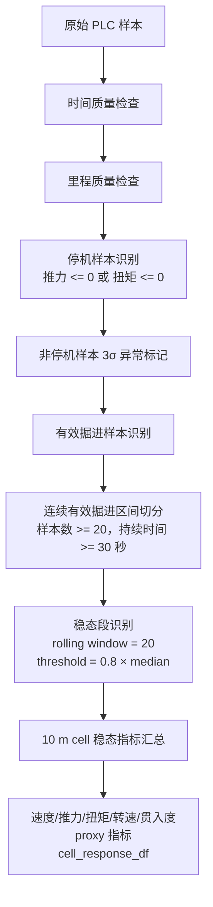

---

## 图 4：地质证据治理与证据角色

这一图的输入是已经建好的正式 `evidence_db.csv`，不是原始 PDF。原始 PDF 到 `evidence_db.csv` 的建库过程见“补充图 2A”。

### 纯文本版

```text
正式 evidence_db
      │
      ▼
地质证据标准化
      │
      ├─ evidence_id
      ├─ source_type
      ├─ start_chainage / end_chainage
      ├─ hazards / grade / confidence
      └─ source_trace
      │
      ▼
时间可用过滤
      │   只允许报告日期之前或当日已可用证据
      ▼
空间相关筛选
      │
      ├─ 与已掘复核范围重叠
      │       └─ daily_review
      │
      ├─ 位于当前掌子面前方 30 m
      │       └─ forward_attention
      │
      ├─ 位于局部背景范围
      │       └─ local_background
      │
      └─ 不相关或不可用
              └─ excluded
```

### Mermaid 版

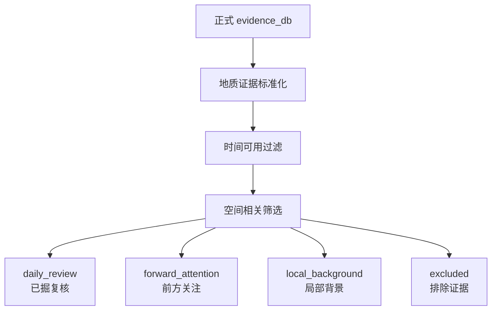

---

## 图 5：三类证据角色的边界

### 纯文本版

```text
┌──────────────────────────────────────────────┐
│ daily_review：已掘复核                       │
│ 可用：PLC、RAI、GRS、GRCI、已掘地质证据       │
│ 禁止：写成前方预测                            │
└──────────────────────────────────────────────┘

┌──────────────────────────────────────────────┐
│ forward_attention：当前掌子面前方关注提示     │
│ 可用：GRS、main_hazards、source_trace、距离分层│
│ 禁止：使用 PLC / RAI / GRCI                  │
│ 禁止：写成已发生事实                          │
└──────────────────────────────────────────────┘

┌──────────────────────────────────────────────┐
│ local_background：局部背景                    │
│ 可用：邻近地质上下文                          │
│ 禁止：作为当日施工异常或高 GRCI 结论           │
└──────────────────────────────────────────────┘
```

### Mermaid 版

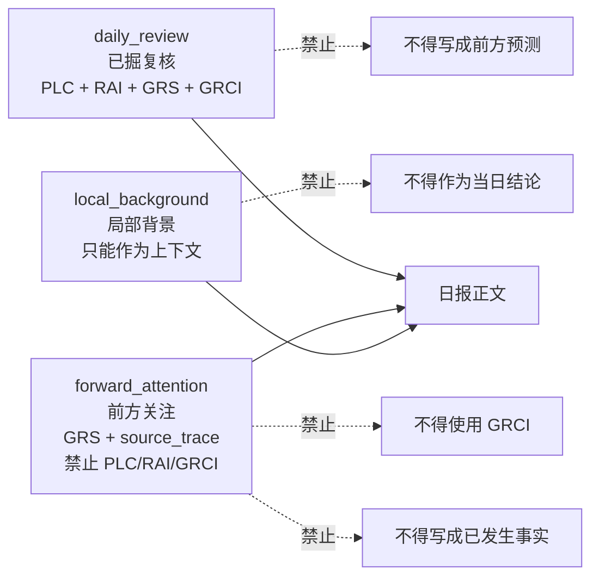

---

## 图 6：ConstructionStateCell 内部结构

### 纯文本版

```text
ConstructionStateCell
│
├─ 位置状态
│   ├─ cell_start / cell_end / cell_center
│   └─ distance_to_face
│
├─ 角色状态
│   ├─ daily_review
│   ├─ forward_attention
│   └─ local_background
│
├─ PLC 施工响应状态
│   ├─ speed / thrust / torque
│   ├─ working-only metrics
│   ├─ steady-state metrics
│   └─ RAI
│
├─ 地质状态
│   ├─ GRS
│   ├─ hazards
│   ├─ fused_grade
│   └─ source_trace
│
├─ 耦合状态
│   ├─ GRCI
│   ├─ GRCI_available
│   ├─ GRCI_unavailable_reason
│   └─ coupling_level
│
└─ 追踪状态
    ├─ supporting_evidence_ids
    ├─ trace_refs
    └─ trace_completeness
```

### Mermaid 版

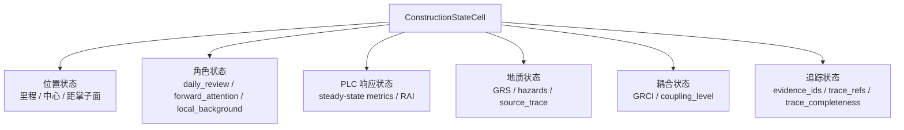

---

## 图 7：DailyConstructionTwin 结构

### 纯文本版

```text
DailyConstructionTwin
│
├─ scope
│   ├─ PLC 实测推进范围
│   ├─ 10m cell 对齐复核范围
│   ├─ 当前掌子面
│   ├─ forward 范围
│   └─ background 范围
│
├─ cells
│   └─ 全部 TwinCellView
│
├─ role groups
│   ├─ daily_review_cells
│   ├─ forward_attention_cells
│   └─ local_background_cells
│
├─ high_grci_cells
│   └─ 只来自 daily_review
│
├─ summaries
│   ├─ operation
│   ├─ response
│   ├─ geology
│   ├─ forward
│   ├─ gas
│   └─ coupling
│
├─ trace_index
│   └─ cell / evidence / source_trace 索引
│
└─ governance
    ├─ role boundaries
    ├─ metric boundaries
    ├─ allowed claims
    └─ forbidden claims
```

### Mermaid 版

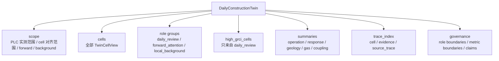

---

## 图 8：RAI、GRS、GRCI 关系

### 纯文本版

```text
PLC 施工响应分量
  stop_ratio
  abnormal_ratio
  speed_drop_score
  torque_volatility_score
  speed_volatility_score
        │
        ▼
RAI：施工响应关注度

地质证据分量
  grade_score_component
  hazard_component
  confidence_component
        │
        ▼
GRS：地质证据关注度

RAI + GRS
        │
        ▼
GRCI：已掘区段地质-施工响应耦合关注度

使用边界：
  仅 daily_review cell 可用
  不用于 forward_attention
  不是灾害概率
  不是前方风险
```

### 公式

```text
RAI =
0.40 × stop_ratio
+ 0.25 × abnormal_ratio
+ 0.20 × speed_drop_score
+ 0.10 × torque_volatility_score
+ 0.05 × speed_volatility_score

GRS =
0.45 × grade_score_component
+ 0.45 × hazard_component
+ 0.10 × confidence_component

GRCI =
0.55 × GRS
+ 0.35 × RAI
+ 0.10 × GRS × RAI
```

### Mermaid 版

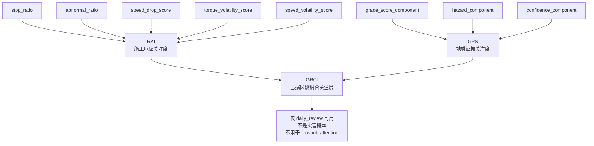

---

## 图 9：Evidence Pack 生成逻辑

### 纯文本版

```text
DailyConstructionTwin
      │
      ├─ daily_review_cells
      │       └─ selection_score = 0.40 GRCI + 0.25 RAI + 0.25 GRS + 0.10 trace
      │
      ├─ forward_attention_cells
      │       └─ selection_score = 0.45 GRS + 0.25 distance_weight + 0.30 trace
      │
      ├─ local_background_cells
      │       └─ selection_score = 0.50 GRS + 0.50 trace
      │
      └─ governance / metric boundaries / forbidden claims
              │
              ▼
        Evidence Pack
              │
              ├─ report_scope
              ├─ operation_evidence
              ├─ gas_evidence
              ├─ geology_evidence
              ├─ evidence_units
              ├─ generation_constraints
              └─ source_trace
```

### Mermaid 版

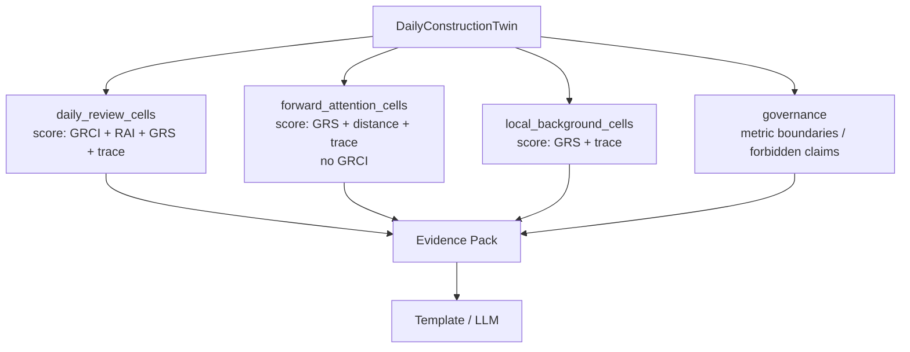

---

## 图 10：后端通用 LLM 链路

### 纯文本版

```text
Evidence Pack
      │
      ├─ template 模式
      │     └─ 固定模板报告
      │
      └─ LLM 模式
            │
            ├─ 可选 Planner
            │     ├─ 生成 report plan
            │     ├─ 检查章节是否完整
            │     ├─ 检查前方章节是否错误允许 RAI/GRCI
            │     └─ 不合格则 fallback 到规则 plan
            │
            ├─ Generator
            │     └─ 根据 Evidence Pack / Plan 生成初稿
            │
            ├─ Quality / Trace 初评
            │
            ├─ 可选 Reviser
            │     └─ 根据初评结果修订报告
            │
            └─ Quality / Trace 复评
```

### Mermaid 版

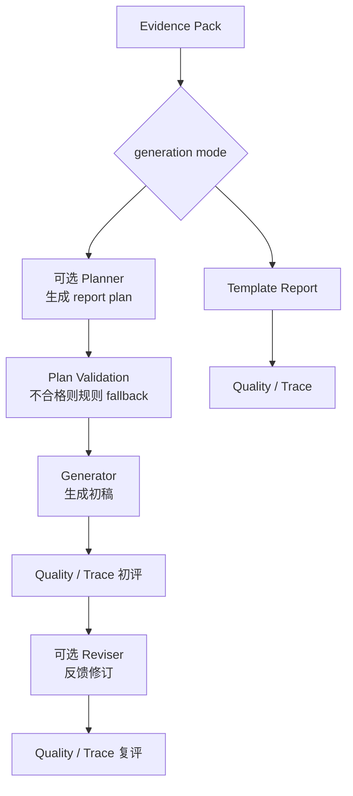

---

## 图 11：Exp02 的 M0-M4 实验链路

### 纯文本版

```text
先运行 no-LLM 主 pipeline
      │
      ├─ baseline template report
      ├─ DailyConstructionTwin
      ├─ Evidence Pack
      ├─ Quality 输入
      └─ Trace 输入
      │
      ▼
五种模式对比

M0：直接使用模板报告，不调用 LLM

M1：只给基础信息，直接 LLM 生成

M2：给原始证据摘要，LLM 生成

M3：给 Twin Evidence Pack，LLM 生成

M4：给 Twin Evidence Pack + governance
    → LLM 生成初稿
    → Quality / Trace / Boundary 初评
    → revision_feedback
    → LLM 修订
    → Section Guard
    → Quality / Trace / Boundary 复评
```

### Mermaid 版

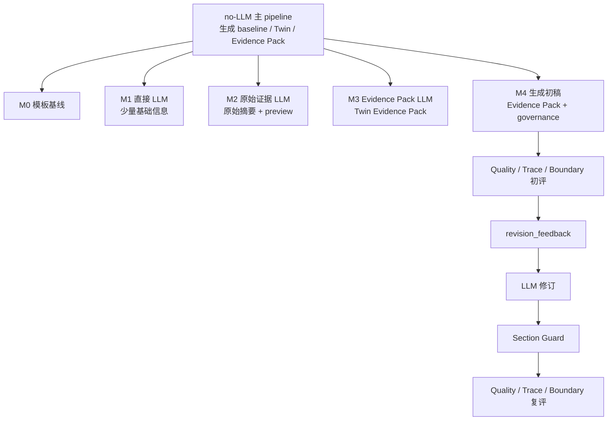

---

## 图 12：M4 完整闭环

### 纯文本版

```text
Evidence Pack
      │
      ▼
M4 Generation Prompt
      │
      ▼
LLM Draft Report
      │
      ├─ Quality Checker
      ├─ Grounding Checker
      ├─ Boundary Checker
      └─ Structured Trace
      │
      ▼
revision_feedback
      │
      ├─ 哪个章节有问题
      ├─ 哪句话有问题
      ├─ 错误类型是什么
      └─ 建议如何改
      │
      ▼
M4 Revision Prompt
      │
      ▼
LLM Revised Report
      │
      ▼
Section Guard
      │
      ▼
Final Report
      │
      ▼
Final Quality / Trace / Boundary
```

### Mermaid 版

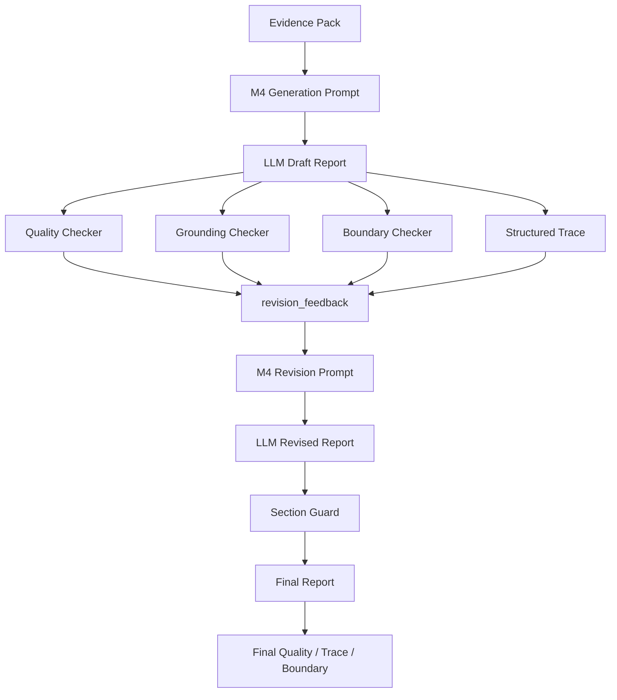

---

## 图 13：评价体系

### 纯文本版

```text
Report Text
      │
      ▼
Claim Extractor
      │   把报告拆成 claim
      ▼
Grounding Checker
      │   检查 claim 是否有 Evidence Pack / Twin 支撑
      ▼
Quality Checker
      │   计算质量分，检查章节、数值、禁用表达和 grounding
      ▼
Boundary Checker
      │   检查 GRCI 概率化、前方事实化、proxy 误用等
      ▼
Structured Trace
      │   汇总 claim、support type、mismatch type 和 trace coverage
      ▼
Experiment Aggregation
      │   汇总每个 date/mode 的 quality、grounding、unsupported、numeric 等
```

### Mermaid 版

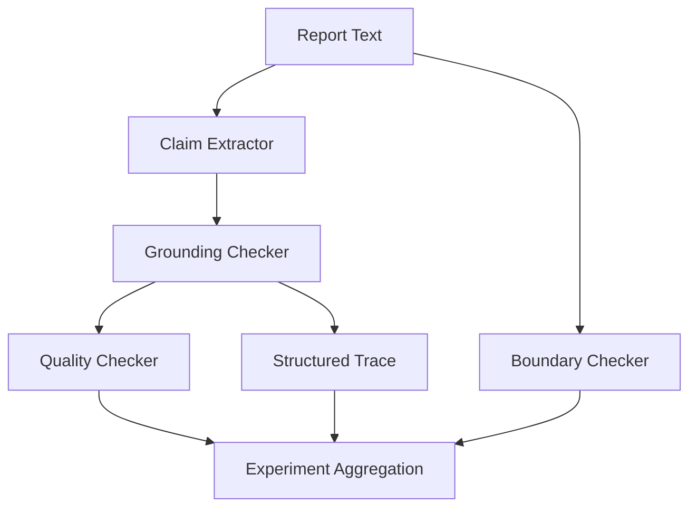

---

## 图 14：错误类型 E1-E14

### 表格版

| 编号 | 含义 |
|---|---|
| E1 | 无证据主张 |
| E2 | 前方预报写成已发生事实 |
| E3 | GRCI 写成概率 |
| E4 | forward 写成已掘复核 |
| E5 | background 写成当日响应 |
| E6 | 气体字段误用 |
| E7 | 无证据建议 |
| E8 | 缺失必要章节 |
| E9 | 证据角色混淆 |
| E10 | 数值无证据 |
| E11 | 标题误抽取 |
| E12 | 方法边界说明 |
| E13 | stop_reason 过度解释 |
| E14 | 对齐复核范围误写为实际推进 |

### 逻辑图

```text
报告错误
│
├─ 证据支撑问题
│   ├─ E1 无证据主张
│   ├─ E7 无证据建议
│   └─ E10 数值无证据
│
├─ 角色边界问题
│   ├─ E2 前方预报事实化
│   ├─ E4 forward 写成已掘复核
│   ├─ E5 background 写成当日响应
│   └─ E9 证据角色混淆
│
├─ 指标语义问题
│   ├─ E3 GRCI 概率化
│   ├─ E13 stop_reason 过度解释
│   └─ E14 对齐范围误写为实际推进
│
├─ 数据字段问题
│   └─ E6 气体字段误用
│
└─ 结构或抽取问题
    ├─ E8 缺失章节
    ├─ E11 标题误抽取
    └─ E12 方法边界说明
```

---

## 图 15：Exp02 91 天结果结构

### 表格版

| 模式 | 质量 | 支撑率 | unsupported | numeric | boundary | missing |
|---|---:|---:|---:|---:|---:|---:|
| M0 模板 | 100.00 | 1.0000 | 0 | 0 | 0 | 0 |
| M1 直接 LLM | 70.76 | 0.7295 | 1143 | 445 | 10 | 182 |
| M2 原始证据 LLM | 72.96 | 0.7253 | 1221 | 334 | 23 | 182 |
| M3 Evidence Pack LLM | 68.93 | 0.7592 | 1256 | 226 | 2 | 184 |
| M4 完整闭环 | 94.18 | 0.9153 | 376 | 78 | 0 | 0 |

### 纯文本解读

```text
M0 高分：
  因为模板确定性强，不代表自由生成能力。

M1 / M2：
  说明直接 LLM 或简单给原始证据仍不稳定。

M3：
  Evidence Pack 提高了证据相关性，但没有修订闭环，仍容易出现 unsupported、numeric 和缺章。

M4：
  完整 Evidence Pack + governance + trace + revision 闭环最稳定。
```

---

## 图 16：Exp03 指标稳健性位置

### 纯文本版

```text
主流程 V0_current
      │
      ├─ RAI 当前公式
      ├─ GRS 当前公式
      └─ GRCI 当前公式
      │
      ▼
旁路复算实验 Exp03
      │
      ├─ V1_percentile_equal
      ├─ V2_percentile_interaction
      ├─ V3_percentile_entropy
      ├─ V4_percentile_critic
      └─ V5_strict_min
      │
      ▼
稳健性比较
      ├─ Spearman 排序相关
      ├─ Top-K Jaccard
      ├─ high attention date overlap
      └─ forward GRCI leakage
```

### Mermaid 版

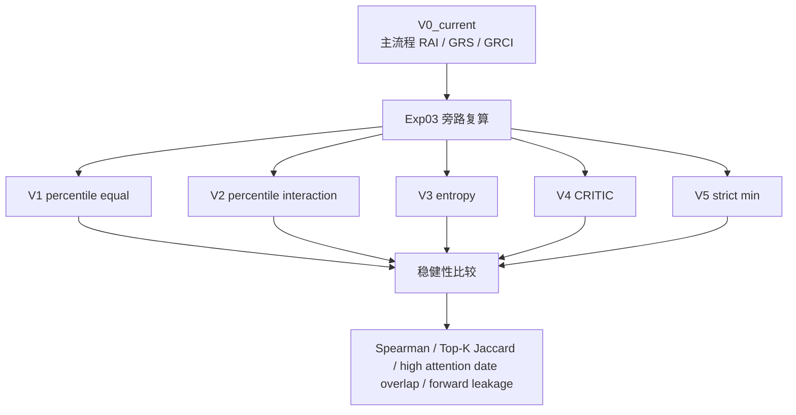

---

## 图 17：当前系统能讲什么，不能讲什么

### 纯文本版

```text
可以讲：
  多源工程证据治理
  施工状态单元 ConstructionStateCell
  DailyConstructionTwin 证据治理型状态孪生
  Evidence Pack 约束生成
  可追溯 LLM 生成与修订
  Quality / Grounding / Boundary / Trace 自动审计
  91 天真实 LLM 生成模式对比
  RAI / GRS / GRCI 启发式指标稳健性分析

不能讲：
  地质灾害预测
  GRCI 是灾害概率
  LLM 判断地质风险
  PLC 判断前方异常
  proxy 是严格物理功率或比能
  物理仿真数字孪生
  跨工程泛化已经证明
  自动评价完全替代人工评价
```

---

## 图 18：最推荐的论文方法主图

这张图适合后续整理成论文中的“总体方法框架图”。

```text
┌───────────────────────────────┐
│ 多源输入                       │
│ PLC / evidence_db / gas        │
└──────────────┬────────────────┘
               ▼
┌───────────────────────────────┐
│ 数据治理                       │
│ PLC 预处理 + 地质时空筛选       │
└──────────────┬────────────────┘
               ▼
┌───────────────────────────────┐
│ 施工状态单元                   │
│ ConstructionStateCell          │
│ RAI / GRS / GRCI               │
└──────────────┬────────────────┘
               ▼
┌───────────────────────────────┐
│ 施工状态孪生底座               │
│ DailyConstructionTwin          │
│ roles / trace / governance     │
└──────────────┬────────────────┘
               ▼
┌───────────────────────────────┐
│ 证据约束材料包                 │
│ Evidence Pack                  │
│ evidence_units / constraints   │
└──────────────┬────────────────┘
               ▼
┌───────────────────────────────┐
│ 受控生成                       │
│ Planner / Generator / Reviser  │
└──────────────┬────────────────┘
               ▼
┌───────────────────────────────┐
│ 可追溯审计                     │
│ Quality / Grounding / Boundary │
│ Structured Trace               │
└──────────────┬────────────────┘
               ▼
┌───────────────────────────────┐
│ 输出                           │
│ 日报 / debug / 实验表格 / 论文材料│
└───────────────────────────────┘
```
